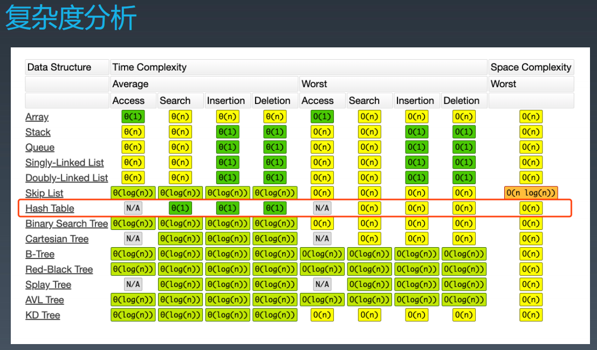
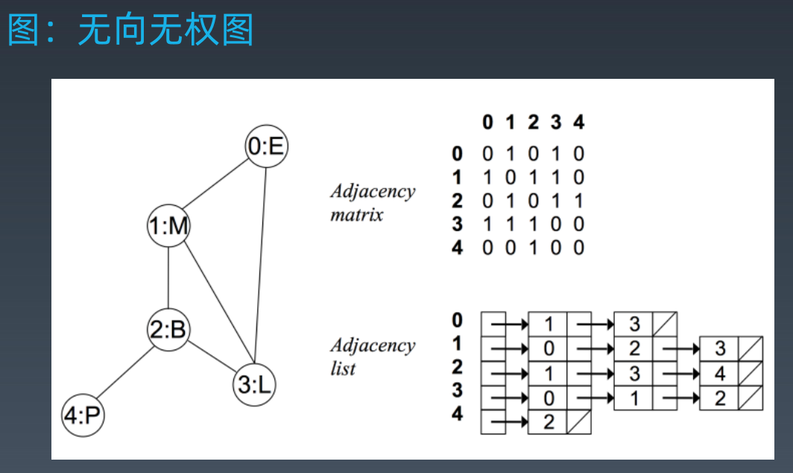
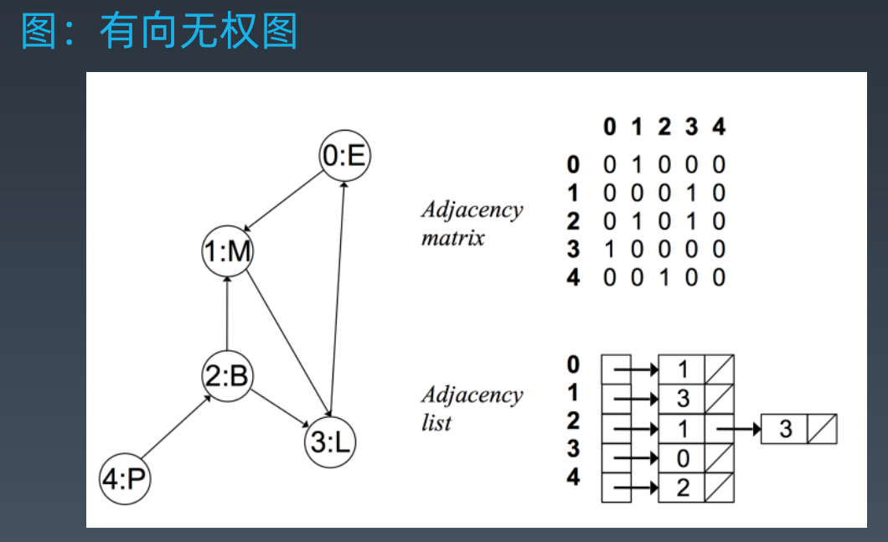
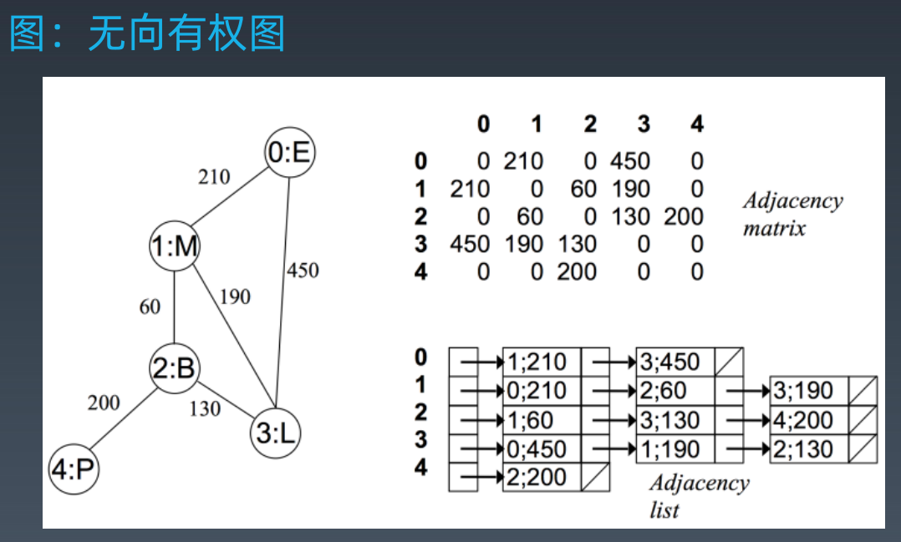

学习笔记
- [4.哈希表](#4哈希表)
  - [4.1.哈希表](#41哈希表)
  - [4.2.实战题目](#42实战题目)
    - [4.2.1.leedcode题目: 242.有效的字母异位词](#421leedcode题目-242有效的字母异位词)
    - [4.2.2.leedcode题目: 49.字母异位词分组](#422leedcode题目-49字母异位词分组)
    - [4.2.3.leedcode题目: 1.两数之和](#423leedcode题目-1两数之和)
- [5.树、二叉树、二叉搜索树](#5树二叉树二叉搜索树)
  - [5.1.树（Tree）](#51树tree)
    - [5.1.1.二叉树遍历Pre-order/In-order/Post-order](#511二叉树遍历pre-orderin-orderpost-order)
    - [5.1.2.二叉搜索树(Binary Search Tree)](#512二叉搜索树binary-search-tree)
  - [5.2.实战题目](#52实战题目)
    - [5.2.1.leedccde题目：94.二叉树的中序遍历](#521leedccde题目94二叉树的中序遍历)
    - [5.2.2.leedcode题目：144.二叉树的前序遍历](#522leedcode题目144二叉树的前序遍历)
    - [5.2.4.leedcode题目：590.N叉树的后序遍历](#524leedcode题目590n叉树的后序遍历)
    - [5.2.5.leedcode题目：589.N叉树的前序遍历](#525leedcode题目589n叉树的前序遍历)
- [6.堆 Heap 和二叉堆（Binary Heap）](#6堆-heap-和二叉堆binary-heap)
  - [6.1.堆 Heap](#61堆-heap)
  - [6.2.二叉堆 Binary Heap](#62二叉堆-binary-heap)
  - [6.2.实战题目](#62实战题目)
    - [6.2.1.剑指offer：40.最小的k个数](#621剑指offer40最小的k个数)
    - [6.2.2.leedcode题目：239.滑动窗口最大值](#622leedcode题目239滑动窗口最大值)
    - [6.2.3.leedcode题目：347.前k个高频元素](#623leedcode题目347前k个高频元素)
- [7.图的实现和特征](#7图的实现和特征)
  - [7.1.图的属性和分类](#71图的属性和分类)
  - [7.2.基于图相关的算法](#72基于图相关的算法)

# 4.哈希表
## 4.1.哈希表 
**<font color=#FF0000>哈希表</font>**(Hash table)，也叫散列表，是根据关键码值(key value)而直接进行访问的数据结构。

它通过把关键码值映射到表中一个位置来访问记录，以加快查找的速度。

这个映射函数叫做散列函数(Hash Function)，存放记录的数组叫做哈希表(或散列表)。

**工程实践**
+ 电话号薄
+ 用户信息表
+ 缓存（LRU Cache）
+ 键值对储存（Redis）---后端会用

Hash Function

Hash Collisions

**复杂度分析**


[图片来源](https://www.bigocheatsheet.com/)

**Hash Table API（java code）**
+ [Map: key-value对，key不重复](https://docs.oracle.com/en/java/javase/12/docs/api/java.base/java/util/Set.html)
   > + new HashMap() / new TreeMap()
   > + map.set(key, value)
   > + map.get(key)
   > + map.has(key)
   > + map.size()
   > + map.clear()
   > + **map.getOrDefault(key, defaultValue)**
+ [Set: 不重复元素的集合](https://docs.oracle.com/en/java/javase/12/docs/api/java.base/java/util/Map.html)
   > + new HashSet() / new TreeSet()
   > + set.add(value)
   > + set.delete(value)
   > + set.hash(value)

## 4.2.实战题目
解题四步法
  > + claification
  > + possible solution --> optimal(time & space)
  > + code
  > + test cases 
### 4.2.1.leedcode题目: [242.有效的字母异位词](https://leetcode-cn.com/problems/valid-anagram/description/)
  + 第一种解法：暴力法：sort，sort_str 相等？  O(nlogn)
  ```java
   public boolean isAnagram(String s, String t) {
      if (s.length() != t.length()) return false;
      char[] s1 = s.toCharArray();
      char[] t1 = t.toCharArray();
      Arrays.sort(s1);
      Arrays.sort(t1);
      return Arrays.equals(s1,t1);
   }
  ```
复杂度：时间复杂度O(nlogn)，空间复杂度O(1)
  + 第二种解法：hash，map --> 统计每个字符的频次
```java
public boolean isAnagram(String s, String t) {
   if (s.length() != t.length()) return false;
   int[] count = new int[26];
   for (int i = 0; i < s.length(); i++){
      count[s.charAt(i)-'a']++;
      count[t.charAt(i)-'a']--;
   }
   for (int c:count){
      if (c != 0){
            return false;
      }
   }
   return true;
}
```
```java
public boolean isAnagram2(String s, String t){
   if (s.length() != t.length()) return false;
   Map<Character, Integer> map = new HashMap<>();

   for (int i = 0; i < s.length(); i++){
      int count = map.getOrDefault(s.charAt(i),0)+1;
      map.put(s.charAt(i),count);
   }
   for (int j = 0; j < t.length(); j++){
      int count = map.getOrDefault(t.charAt(j),0);
      if (count > 0){
            count--;
      }
      if (count > 0){
            map.put(t.charAt(j),count);
      }else {
            map.remove(t.charAt(j));
      }
   }
   boolean flag = true;
   for (Character c : map.keySet()){
      if (map.get(c) != 0){
            flag = false;
      }
   }
   return flag;
}
```
### 4.2.2.leedcode题目: [49.字母异位词分组](https://leetcode-cn.com/problems/group-anagrams/)

+ 第一种解法：排序数组分类
  + 维护一个映射 map {String --> List}，其中的每一个键值K是一个字符串，每个值排序后是K
```java
public List<List<String>> groupAnagrams(String[] strs) {
   if (strs.length == 0) return new ArrayList<>();
   Map<String, List> map = new HashMap<>();
   for (String s : strs){
      char[] arr = s.toCharArray();
      Arrays.sort(arr);
      String key = String.valueOf(arr);
      if (!map.containsKey(key)) {
            map.put(key, new ArrayList());
      }
      map.get(key).add(s);
   }
   return new ArrayList(map.values());
}
```
**复杂度**：时间复杂度O(NKlogK)，其中 N 是 strs 的长度，而 K 是 strs 中字符串的最大长度。当我们遍历每个字符串时，外部循环具有的复杂度为 O(N)。然后，我们在 O(KlogK) 的时间内对每个字符串排序。空间复杂度：O(NK)，排序存储在 ans 中的全部信息内容。

+ 第二种解法：按计数分类
```java
public List<List<String>> groupAnagram2(String[] strs) {
   if (strs.length == 0) return new ArrayList<>();
   Map<String, List> map = new HashMap<>();
   int[] count = new int[26];
   for (String s : strs){
      Arrays.fill(count,0);
      for (int i = 0; i < s.length(); i++){
            count[s.charAt(i)-'a']++;
      }
      StringBuilder sb = new StringBuilder("");
      for (int i = 0; i < 26; i++){
            sb.append(count[i]);
      }
      String key = sb.toString();
      if (!map.containsKey(key)) {
            map.put(key, new ArrayList());
      }
      map.get(key).add(s);
   }
   return new ArrayList(map.values());
}
```
**复杂度**：时间复杂度：O(NK)，其中 N 是 strs 的长度，而 K 是 strs 中字符串的最大长度。计算每个字符串的字符串大小是线性的，我们统计每个字符串。空间复杂度：O(NK)，排序存储在 ans 中的全部信息内容。

### 4.2.3.leedcode题目: [1.两数之和](https://leetcode-cn.com/problems/two-sum/description/)

+ 第一种解法：暴力法，两边循环，找到和等于target的两个数
```java
public int[] twoSum(int[] nums,int target){
   int[] ans = new int[2];
   for (int i = 0; i < nums.length-1; i++){
      for (int j = i + 1; j < nums.length; j++){
            if (nums[i] + nums[j] == target){
               ans[0] = i;
               ans[1] = j;
            }
      }
   }
   return ans;
}
```
**复杂度**：时间复杂度O(n^2)，空间复杂度O(1)。

+ 第二种解法：遍历两遍哈希表
```java
public int[] twoSum2(int[] nums, int target){
   Map<Integer,Integer> map = new HashMap<>();
   for (int i = 0; i < nums.length; i++){
      map.put(nums[i],i);
   }
   int[] ans = new int[2];
   for (int j = 0; j < nums.length; j++){
      int cont = target - nums[j];
      if (map.containsKey(cont) && map.get(cont) != j){
            ans[0] = j;
            ans[1] = map.get(cont);
      }
   }
   return ans;
}
```
**复杂度**：时间复杂度O(n)，空间复杂度O(n)

+ 第三种解法：一遍哈希表法
```java
public int[] twoSum3(int[] nums,  int target){
   Map<Integer,Integer> map = new HashMap<>();
   int[] ans = new int[2];
   for (int i = 0; i < nums.length; i++){
      int cont = target - nums[i];
      if (map.containsKey(cont)){
            ans[0] = i;
            ans[1] = map.get(cont);
      }
      map.put(nums[i],i);
   }
   return ans;
}
```
**复杂度**：时间复杂度O(n)，空间复杂度O(n)


# 5.树、二叉树、二叉搜索树

## 5.1.树（Tree）

树可以看做是链表衍生的，根节点，子节点（左结点，右节点），父节点

- Linked list是特殊化的Tree
- Tree是特殊化的Graph

很多工程需要解决二维的问题

### 5.1.1.二叉树遍历Pre-order/In-order/Post-order

示例代码
```java
public class TreeNode{
   public int val;
   public TreeNode left,right;
   public TreeNode(int val){
      this.val = val;
      this.left = null;
      this.right = null;
   }
}
```
+ 1.前序（Pre-order）：根-左-右
+ 2.中序（In-order）：左-根-右
+ 3.后序（Post-order）：左-右-根
```python
def preorder(self,root):
   if root:
      self.traverse_path.append(root.val)
      self.preorde(root.left)
      self.preorder(root.right)

def inorder(self,root):
   if root:
      self.inorder(root.left)
      self.traverse_path.append(root.val)
      self.inorder(root.right)

def postorder(self.root):
   if root:
      self.postorder(root.left)
      self.postorder(root.right)
      self.traverse_path.append(root.val)
```

### 5.1.2.二叉搜索树(Binary Search Tree)

二叉搜索树，也称二叉排序树、有序二叉树（Order Binary Tree）、排序二叉树（Sorted Binary Tree），是指一棵空树或者具有下列性质的二叉树：
+ 1.左子树上<font color=#FF8C00>所有节点</font>的值均小于它的根节点的值；
+ 2.右子树上<font color=#FF8C00>所有节点</font>的值均大于它的根节点的值
+ 3.以此类推：左、右子树也分别为二叉查找树。（这就是**重复性**）

中序遍历：升序排列

常见操作：
+ 1、查询
+ 2、插入新节点（创建）
+ 3、删除
  
  [二叉搜索树demo](https://visualgo.net/zh/bst?slide=1)  

## 5.2.实战题目

### 5.2.1.leedccde题目：[94.二叉树的中序遍历](https://leetcode-cn.com/problems/binary-tree-inorder-traversal/)
+ 第一种解法：递归
  + [递归的模板](https://shimo.im/docs/EICAr9lRPUIPHxsH/read)
```java
public void recur(int level, int param) {
   //termintor（终止条件）
   if (level > MAX_LEVEL) {
      //process result
      return;
   }
   //process current logic
   process(level, param);
   //drill down
   recur(level:level + 1, newParam);
   //restore current status
}
```
 
借助一个辅助函数实现递归
```java
public List<Integer> inorderTraversal(TreeNode root) {
   List<Integer> ans = new ArrayList<>();
   helper(root,ans);
   return ans;
}
private void helper(TreeNode root, List<Integer> ans) {
   if (root != null){
      if (root.left != null){
            helper(root.left,ans);
      }
      ans.add(root.val);
      if (root.right != null){
            helper(root.right,ans);
      }
   }
}
```
**复杂度**：时间复杂度：O(n)。递归函数 T(n) = 2 \cdot T(n/2)+1T(n)=2⋅T(n/2)+1。 空间复杂度：最坏情况下需要空间O(n)，平均情况为O(\log n)O(logn)。

+ 第二种解法：基于栈的遍历
在递归的基础上，使用栈的方式
```java
public List<Integer> inorderTraversal2(TreeNode root){
   List<Integer> ans = new ArrayList<>();
   Stack<TreeNode> stack = new Stack<>();
   TreeNode curr = root;
   while (curr != null || !stack.isEmpty()){
      while (curr != null){
            stack.push(curr);
            curr = curr.left;
      }
      curr = stack.pop();
      ans.add(curr.val);
      curr = curr.right;
   }
   return ans;
}
```
复杂度：时间复杂度O(n)，空间复杂度O(n)

+ 第三种解法：莫里斯遍历
  
  先了解下 [线索二叉树](https://baike.baidu.com/item/%E7%BA%BF%E7%B4%A2%E4%BA%8C%E5%8F%89%E6%A0%91/10810037?fr=aladdin) 和 [莫里斯解法](https://stackoverflow.com/questions/5502916/explain-morris-inorder-tree-traversal-without-using-stacks-or-recursion) 后再学习此解法

### 5.2.2.leedcode题目：[144.二叉树的前序遍历](https://leetcode-cn.com/problems/binary-tree-preorder-traversal/)

+ 第一种解法：递归
```java
public List<Integer> preorderTraversalRecur(TreeNode root) {
   List<Integer> ans = new ArrayList<>();
   helper(root, ans);
   return ans;
}
public void helper(TreeNode root, List<Integer> ans){
   if (root != null){
      ans.add(root.val);
      if (root.left != null) helper(root.left,ans);
      if (root.right != null) helper(root.right,ans);
   }
}
```
复杂度：时间复杂度O(n)，空间复杂度O(n)

+ 第二种解法：使用栈迭代
```java
public List<Integer> preorderTraversal_stack(TreeNode root){
   List<Integer> ans = new ArrayList<>();
   Stack<TreeNode> stack = new Stack<>();
   if (root == null){
      return ans;
   }
   stack.add(root);
   while (!stack.isEmpty()){
      TreeNode node = stack.pop();
      ans.add(node.val);
      if (node.right != null){
            stack.add(node.right);
      }
      if (node.left != null){
            stack.add(node.left);
      }
   }
   return ans;
}
```
复杂度：时间复杂度O(n)，空间复杂度O(n)

[调用栈的思路讲解](https://leetcode-cn.com/problems/binary-tree-preorder-traversal/solution/miao-sha-quan-chang-ba-hou-lang-by-sonp/)

### 5.2.4.leedcode题目：[590.N叉树的后序遍历](https://leetcode-cn.com/problems/n-ary-tree-postorder-traversal/)

+ 第一种解法：递归
```java
 public List<Integer> postorder(Node root) {
   List<Integer> ans = new ArrayList<>();
   if (root == null){
      return ans;
   }
   helper(root , ans);
   return ans;
}

private void helper(Node root, List<Integer> ans) {
   if (root.children == null){
      ans.add(root.val);
      return;
   }
   for (Node n : root.children){
      helper(n, ans);
   }
   ans.add(root.val);
}
```

+ 第二种解法：迭代
```java
public List<Integer> postorder2(Node root){
   LinkedList<Integer> ans = new LinkedList<>();
   LinkedList<Node> stack = new LinkedList<>();
   if (root == null){
      return ans;
   }
   stack.add(root);
   while (!stack.isEmpty()) {
      Node node = stack.pollLast();
      ans.addFirst(node.val);
      for (Node item : node.children) {
            if (item != null) {
               stack.add(item);
            }
      }
   }
   return ans;
}
```

### 5.2.5.leedcode题目：[589.N叉树的前序遍历](https://leetcode-cn.com/problems/n-ary-tree-preorder-traversal/submissions/)

+ 第一种解法：递归
```java
public List<Integer> preorder(Node root) {
   List<Integer> ans = new ArrayList<>();
   if (root == null){
      return ans;
   }
   helper(root, ans);
   return ans;
}

private void helper(Node root, List<Integer> ans) {
   if (root.children == null){
      ans.add(root.val);
      return;
   }
   ans.add(root.val);
   for (Node n : root.children){
      helper(n,ans);
   }
}
```
+ 第二种解法：迭代
```java
public List<Integer> preoder1(Node root){
   LinkedList<Integer> ans = new LinkedList<>();
   LinkedList<Node> stack = new LinkedList<>();
   if (root == null){
      return ans;
   }

   stack.add(root);
   while (!stack.isEmpty()){
      Node node = stack.pollLast();
      ans.add(node.val);
      Collections.reverse(node.children);
      for (Node n : node.children){
            stack.add(n);
      }
   }
   return ans;
}
```

# 6.堆 Heap 和二叉堆（Binary Heap）

## 6.1.堆 Heap

Heap: 可以迅速找到一堆数中**最大**或者**最小**的数据结构。

将根节点最大的堆叫做大顶堆或者大根堆，根节点最小的堆叫做小顶堆或小根堆。常见的堆有二叉堆、斐波那契堆等。

假设是大顶堆，则常见操作（API）：
+ find-max：O(1)
+ delete-max：O(logn)
+ insert(create): O(logn) or O(1)

不同实现的比较:[Heap的维基百科](https://en.wikipedia.org/wiki/Heap_(data_structure))

## 6.2.二叉堆 Binary Heap

通过完全二叉树来实现（注意：不是二叉搜索树）；

二叉堆（大顶）满足以下性质：
+ [性质一]是一个完全树
+ [性质二]树中任意节点的值总是>=其子节点的值。

**二叉堆实现的细节**
+ 1.二叉堆一般都通过“**数组**”来实现
+ 2.假设“第一个元素”在数组中的索引为0的话，则父节点和子节点的位置关系如下：
  + (01)索引为 i 的左孩子的索引是（2*i+1）；
  + (02)索引为 i 的右孩子的索引是（2*i+2）；
  + (03)索引为 i 的父节点的索引是 floor((i-1)/2);

**Insert 插入操作 O(logn)**
+ 1.新元素一律先插入到堆的尾部
+ 2.依次向上调整整个堆的结构（一直到根即可） HeapifyUp

**Delete Max 删除堆顶元素**
+ 1.将堆尾元素替换到顶部（即对顶被替代删除掉）
+ 2.依次从根部向下调整整个堆的结构（一直到堆尾即可）HeapifyDown

注意：二叉堆是堆（优先队列 priority_queue)的一种常见且简单的实现；但是并不是最优的实现。

[堆的实现代码](https://shimo.im/docs/Lw86vJzOGOMpWZz2/read)

[HeapSort](https://www.geeksforgeeks.org/heap-sort/)


## 6.2.实战题目

### 6.2.1.剑指offer：[40.最小的k个数](https://leetcode-cn.com/problems/zui-xiao-de-kge-shu-lcof/)

+ 第一种解法：sort；nlogn
+ 第二种解法：heap：nlogk

+ 第三种解法：quick-sort

### 6.2.2.leedcode题目：[239.滑动窗口最大值](https://leetcode-cn.com/problems/sliding-window-maximum/)

+ 第一种解法：双端队列
+ 第二种解法：

### 6.2.3.leedcode题目：[347.前k个高频元素](https://leetcode-cn.com/problems/top-k-frequent-elements/)

应用：任务的调度、各个请求的处理

+ 第一种解法：统计元素出现的频次，哈希表

# 7.图的实现和特征

## 7.1.图的属性和分类

**图的属性**
+ Graph(V,E)
+ V - vertex:点
  + 1.度 - 入度和出度
  + 2.点与点之间：连通与否
+ E - edge：边
  + 1.有向和无向（单行线）
  + 权重（边长）

**图的表示和分类**

邻接矩阵 Adjacency matrix；邻接表 Adjacency list
+ 图：无向无权图

+ 图：有向无权图

+ 图：无向有权图

+ 图：有向有权图

## 7.2.基于图相关的算法

+ DFS 代码 - 递归写法
+ BFS 代码

**图的高级算法**
+ [连通图个数](https://leetcode-cn.com/problems/number-of-islands/)
+ [拓扑排序(Topological Sorting)](https://zhuanlan.zhihu.com/p/34871092)
+ [最短路径(Shortest Path Dijkstra)](https://www.bilibili.com/video/av25829980?from=search&seid=13391343514095937158)
+ [最小生成树(Minimum Spanning Tree)](https://www.bilibili.com/video/av84820276?from=search&seid=17476598104352152051)

  