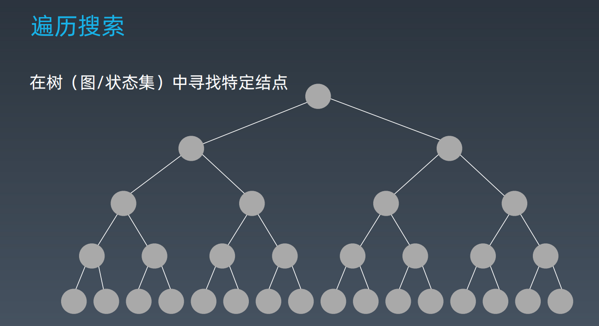

- [10.深度优先搜索和广度优先搜索](#10深度优先搜索和广度优先搜索)
  - [10.1.遍历](#101遍历)
  - [10.2.深度优先搜索（Depth-First-Search)](#102深度优先搜索depth-first-search)
  - [10.3.广度优先搜索（Breadth-First-Search）](#103广度优先搜索breadth-first-search)
  - [10.4.实战题目](#104实战题目)
    - [10.4.1.leedcode题目：102.二叉树的层序遍历](#1041leedcode题目102二叉树的层序遍历)
    - [10.4.2.leedcode题目：433.最小基因变化](#1042leedcode题目433最小基因变化)
    - [10.4.3.leedcode题目：22.括号生成](#1043leedcode题目22括号生成)
    - [10.4.4.leedcode题目：515.在每个树行中找最大值](#1044leedcode题目515在每个树行中找最大值)
    - [10.4.5.leedcode题目：127.单词接龙](#1045leedcode题目127单词接龙)
    - [10.4.6.leedcode题目：126.单词接龙 II](#1046leedcode题目126单词接龙-ii)
    - [10.4.7.leedcode题目：200.岛屿数量](#1047leedcode题目200岛屿数量)
    - [10.4.8.leedcode题目：529.扫雷游戏](#1048leedcode题目529扫雷游戏)
- [11.贪心算法 Greedy](#11贪心算法-greedy)
  - [11.1.知识点](#111知识点)
  - [11.2.实战题目](#112实战题目)
    - [11.2.1.leedcode题目：322.零钱兑换](#1121leedcode题目322零钱兑换)
    - [11.2.2.leedcode题目：860.柠檬水找零](#1122leedcode题目860柠檬水找零)
    - [11.2.3.leedcode题目：122.买卖股票的最佳时机 II](#1123leedcode题目122买卖股票的最佳时机-ii)
    - [11.2.4.leedcode题目：455.分发饼干](#1124leedcode题目455分发饼干)
    - [11.2.5.leedcode题目：874.模拟行走机器人](#1125leedcode题目874模拟行走机器人)
    - [11.2.6.leedcode题目：55.跳跃游戏](#1126leedcode题目55跳跃游戏)
    - [11.2.7.leedcode题目：45.跳跃游戏 II](#1127leedcode题目45跳跃游戏-ii)
- [12.二分查找](#12二分查找)
  - [12.1.知识点](#121知识点)
  - [12.2.实战题目](#122实战题目)
    - [12.2.1.leedcode题目：69.x 的平方根](#1221leedcode题目69x-的平方根)
    - [12.2.2.leedcode题目：367.有效的完全平方数](#1222leedcode题目367有效的完全平方数)
    - [12.2.3.leedcode题目：33.搜索旋转排序数组](#1223leedcode题目33搜索旋转排序数组)
    - [12.2.4.leedcode题目：74.搜索二维矩阵](#1224leedcode题目74搜索二维矩阵)
    - [12.2.5.leedcode题目：153.寻找旋转排序数组中的最小值](#1225leedcode题目153寻找旋转排序数组中的最小值)
    - [12.2.6.课后作业](#1226课后作业)


# 10.深度优先搜索和广度优先搜索

## 10.1.遍历

+ 遍历搜索
  


示例代码：

python

```python
class TreeNode:
    def __init__(self, val):
        self.val = val
        self.left, self.right = None, None
```

Java

```java
public class TreeNode{
    public int val;
    public TreeNode left, right;
    public TreeNode(int val){
        this.val = val;
        this.left = null;
        this.right = null;
    }
}
```

C++

```C++
struct TreeNode{
    int val;
    TreeNode *left;
    TreeNode *right;
    TreeNode(int x): val(x), left(NULL), right(NULL) {}
}
```

+ 搜索 - 遍历
  + 每个节点都要访问一次
  + 每个节点仅仅要访问一次
  + 对于节点的访问顺序不限
    + 深度优先：depth first search
    + 广度优先：breadth first search

代码示例：

python 
```python
def dfs(node):
    if node in visited:
        # already visited
        return
    
    visited.add(node)

    # process current node
    #...# logic here

    dfs(node.left)
    dfs(node.right)
```

## 10.2.深度优先搜索（Depth-First-Search)

[DFS 代码模板](https://shimo.im/docs/UdY2UUKtliYXmk8t/read)

+ **DFS 代码 - 递归写法**

Python

```python
visited = set()

def dfs(node, visited):
    if node in visited:
    # already visited
        return
    
    visited.add(node)

    #process current node here
    for next_node in node.children():
        if not next_node in visited:
            dfs(next node, visited)
```

Java

```java
public List<List<Integer>> levelorder(TreeNode root) {
    List<List<Integer>> allResults = new ArrayList<>();
    if (root == null) {
        return allResults;
    }
    travel(root, 0, allResults);
    return allResults;
}

private void travel(TreeNode root, int level, List<List<Integer>> results){
    if(results.size() == level){
        resuls.add(new ArrayList<>());
    }
    results.get(level).add(root.val);
    if(root.left != null){
        travel(root.left, level+1, results);
    }
    if(root.right != null){
        travel(root.right, level+1, results);
    }
}
```

+ **DFS 代码 - 非递归写法**


Python

```python
def DFS(self,tree):
    if tree.root is None:
        return []
    
    visited, stack = [] , [tree.root]

    while stack:
        node = stack.pop()
        visited.add(node)

        process(node)
        node = generate_related_nodes(node)
        stack.push(nodes)
    
    # other processing work
```

Java

```java

```
## 10.3.广度优先搜索（Breadth-First-Search）

[BFS 代码模板](https://shimo.im/docs/ZBghMEZWix0Lc2jQ/read)

BFS 代码

python

```python
def BFS(graph, start, end):

    queue = []
    queue.append([start])
    visited.add(start)

    while queue:
        node = queue.pop()
        visited.add(node)

        process(node)
        nodes = generate_related_nodes(node)
        queue.push(nodes)

    # other processing work
```

java

```java
public class TreeNode{
    int val;
    TreeNode left;
    TreeNode right;

    TreeNode(int x){
        val = x;
    }
}

public List<List<Integer>> levelorder(TreeNode root){
    List<List<Integer>> allResults = new ArrayList<()>;
    if(root == null){
        return allResults;
    }

    Queue<TreeNode> nodes = new LinkedList<();
    nodes.add(root);
    while(!nodes.isEmpty()){
        int size = nodes.size();
        List<Integer> results = new ArrayList<>();
        for(int i = 0; i < size; i++){
            TreeNode node = nodes.poll();
            results.add(node.val);
            if(node.left != null){
                nodes.add(node.left);
            }
            if(node.right != null){
                nodes.add(node.right);
            }
        }
        allResults.add(results);
    }
    return allResults;
}
```

## 10.4.实战题目

### 10.4.1.leedcode题目：[102.二叉树的层序遍历](https://leetcode-cn.com/problems/binary-tree-level-order-traversal/#/description)


### 10.4.2.leedcode题目：[433.最小基因变化](https://leetcode-cn.com/problems/minimum-genetic-mutation/#/description)


### 10.4.3.leedcode题目：[22.括号生成](https://leetcode-cn.com/problems/generate-parentheses/#/description)


### 10.4.4.leedcode题目：[515.在每个树行中找最大值](https://leetcode-cn.com/problems/find-largest-value-in-each-tree-row/#/description)


### 10.4.5.leedcode题目：[127.单词接龙](https://leetcode-cn.com/problems/word-ladder/description/)


### 10.4.6.leedcode题目：[126.单词接龙 II](https://leetcode-cn.com/problems/word-ladder-ii/description/)


### 10.4.7.leedcode题目：[200.岛屿数量](https://leetcode-cn.com/problems/number-of-islands/)


### 10.4.8.leedcode题目：[529.扫雷游戏](https://leetcode-cn.com/problems/minesweeper/description/)


# 11.贪心算法 Greedy

## 11.1.知识点

**贪心算法概念**：是以一种在每一步选择中都采取当下状态最好的或最优（即最有利）的选择，从而希望导致结果是全局最好或最优的算法。

**贪心算法、动态规划的区别**：贪心算法对每个子问题的解决方案都做出选择，不能回退。动态规划则会保存以前的运算结果，并根据以前的结果对当前进行选择，有回退功能。

**贪心算法用处**：解决一些最优化问题，如：求图中的最小生成树，求哈夫曼编码等，然而对于工程和生活中的问题，贪心算法一般不能得到我们所要求的答案，原因是：局部最优不是全局最优。一旦一个问题可以通过贪心法来解决，那么贪心法一般是解决这个问题的最好办法。由于贪心算法的高效性以及其所求得的答案比较接近最优结果，贪心法也可以用作辅助算法或者直接解决一些要求结果不特别精确的问题。

**贪心算法应用场景**：简单来说，问题能够分解成子问题来解决，子问题的最优解能递归推到最终问题的最优解。这种子问题最优解称为最优子结构。

[动态规划定义](https://zh.wikipedia.org/wiki/%E5%8A%A8%E6%80%81%E8%A7%84%E5%88%92)

## 11.2.实战题目

### 11.2.1.leedcode题目：[322.零钱兑换](https://leetcode-cn.com/problems/coin-change/)

### 11.2.2.leedcode题目：[860.柠檬水找零](https://leetcode-cn.com/problems/lemonade-change/description/)


### 11.2.3.leedcode题目：[122.买卖股票的最佳时机 II](https://leetcode-cn.com/problems/best-time-to-buy-and-sell-stock-ii/description/)


### 11.2.4.leedcode题目：[455.分发饼干](https://leetcode-cn.com/problems/assign-cookies/description/)


### 11.2.5.leedcode题目：[874.模拟行走机器人](https://leetcode-cn.com/problems/walking-robot-simulation/description/)


### 11.2.6.leedcode题目：[55.跳跃游戏](https://leetcode-cn.com/problems/jump-game/)

+ 第一种解法：从后往前的贪心算法
```java
public class Solution55 {
    public boolean canJump(int[] nums) {
        int n = nums.length - 1;
        for (int i = n; i >= 0 ; i--){
            if (nums[i] + i >= n){
                n = i;
            }
        }
        if (n == 0) return true;
        return false;
    }
}
```

### 11.2.7.leedcode题目：[45.跳跃游戏 II](https://leetcode-cn.com/problems/jump-game-ii/)


# 12.二分查找

## 12.1.知识点

**二分查找的前提**：
+ 目标函数单调性（单调递增或者递减）
+ 存在上下界（bounded）
+ 能够通过索引访问（index accessible）

**代码模板**

```python
left, right = 0, len(array)-1
while left <= right:
    mid = (left + right) / 2
    if array[mid] == target:
        #find the target
        break or return result
    elif array[mid] < target:
        left = mid + 1
    else:
        right = mid - 1
```

```java
public int binarySearch(int[] array, int target) {
    int left = 0;
    int right = array.lenght - 1;
    int mid = (left + right) / 2;
    while(left <= right){
        if (array[mid] == target){
            return mid;
        } else if (array[mid] < target){
            left = mid + 1;
        } else {
            right = mid - 1;
        }
    }
    return -1;
}
```

[二分查找代码模板](https://shimo.im/docs/xvIIfeEzWYEUdBPD/read)

[Fast InvSqrt()扩展阅读](https://www.beyond3d.com/content/articles/8/)

## 12.2.实战题目

### 12.2.1.leedcode题目：[69.x 的平方根](https://leetcode-cn.com/problems/sqrtx/)


### 12.2.2.leedcode题目：[367.有效的完全平方数](https://leetcode-cn.com/problems/valid-perfect-square/)


### 12.2.3.leedcode题目：[33.搜索旋转排序数组](https://leetcode-cn.com/problems/search-in-rotated-sorted-array/)


### 12.2.4.leedcode题目：[74.搜索二维矩阵](https://leetcode-cn.com/problems/search-a-2d-matrix/)


### 12.2.5.leedcode题目：[153.寻找旋转排序数组中的最小值](https://leetcode-cn.com/problems/find-minimum-in-rotated-sorted-array/)


### 12.2.6.课后作业

使用二分查找，寻找一个半有序数组 [4, 5, 6, 7, 0, 1, 2] 中间无序的地方

