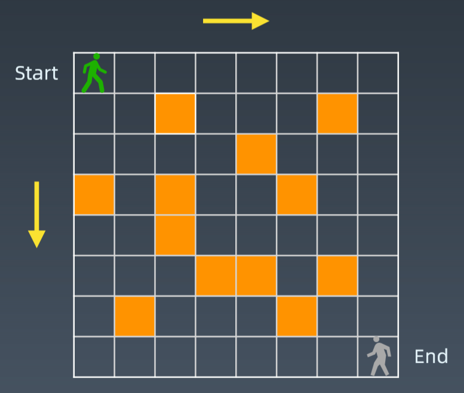

学习笔记

- [13.动态规划](#13动态规划)
  - [13.1.知识点](#131知识点)
  - [13.2.实战题目](#132实战题目)
    - [13.2.1.leedcode题目：斐波拉契数列](#1321leedcode题目斐波拉契数列)
    - [13.2.2.leedcode题目：路径计数](#1322leedcode题目路径计数)
    - [13.2.3.leedcode题目：62.不同路径](#1323leedcode题目62不同路径)
    - [13.2.4.leedcode题目：63.不同路径 II](#1324leedcode题目63不同路径-ii)
    - [13.2.5.leedcode题目：1143.最长公共子序列](#1325leedcode题目1143最长公共子序列)
    - [13.2.6.leedcode题目：70.爬楼梯](#1326leedcode题目70爬楼梯)
    - [13.2.7.leedcode题目：120.三角形最小路径和](#1327leedcode题目120三角形最小路径和)
    - [13.2.8.leedcode题目：53.最大子序和](#1328leedcode题目53最大子序和)
    - [13.2.9.leedcode题目：152.乘积最大子数组](#1329leedcode题目152乘积最大子数组)
    - [13.2.10.leedcode题目：322.零钱兑换](#13210leedcode题目322零钱兑换)
    - [13.2.11.leedcode题目：打家劫舍（字节跳动、谷歌、亚马逊在半年内面试中考过）](#13211leedcode题目打家劫舍字节跳动谷歌亚马逊在半年内面试中考过)
    - [13.2.12.leedcode题目：打家劫舍 II （字节跳动在半年内面试中考过）](#13212leedcode题目打家劫舍-ii-字节跳动在半年内面试中考过)
    - [13.2.13.leedcode题目：买卖股票的最佳时机（亚马逊、字节跳动、Facebook 在半年内面试中常考）](#13213leedcode题目买卖股票的最佳时机亚马逊字节跳动facebook-在半年内面试中常考)
    - [13.2.14.leedcode题目：买卖股票的最佳时机 II （亚马逊、字节跳动、微软在半年内面试中考过）](#13214leedcode题目买卖股票的最佳时机-ii-亚马逊字节跳动微软在半年内面试中考过)
    - [13.2.15.leedcode题目：买卖股票的最佳时机 III （字节跳动在半年内面试中考过）](#13215leedcode题目买卖股票的最佳时机-iii-字节跳动在半年内面试中考过)
    - [13.2.16.leedcode题目：最佳买卖股票时机含冷冻期（谷歌、亚马逊在半年内面试中考过）](#13216leedcode题目最佳买卖股票时机含冷冻期谷歌亚马逊在半年内面试中考过)
    - [13.2.17.leedcode题目：买卖股票的最佳时机 IV （谷歌、亚马逊、字节跳动在半年内面试中考过）](#13217leedcode题目买卖股票的最佳时机-iv-谷歌亚马逊字节跳动在半年内面试中考过)
    - [13.2.18.leedcode题目：买卖股票的最佳时机含手续费](#13218leedcode题目买卖股票的最佳时机含手续费)
    - [13.2.19.leedcode题目：一个方法团灭 6 道股票问题](#13219leedcode题目一个方法团灭-6-道股票问题)
- [高级 DP 实战题目](#高级-dp-实战题目)
  - [完全平方数（亚马逊、谷歌在半年内面试中考过）](#完全平方数亚马逊谷歌在半年内面试中考过)
  - [编辑距离 （重点）](#编辑距离-重点)
  - [跳跃游戏（亚马逊在半年内面试中考过）](#跳跃游戏亚马逊在半年内面试中考过)
  - [跳跃游戏 II （亚马逊、华为字节跳动在半年内面试中考过）](#跳跃游戏-ii-亚马逊华为字节跳动在半年内面试中考过)
  - [不同路径（Facebook、亚马逊、微软在半年内面试中考过）](#不同路径facebook亚马逊微软在半年内面试中考过)
  - [不同路径 II （谷歌、美团、微软在半年内面试中考过）](#不同路径-ii-谷歌美团微软在半年内面试中考过)
  - [不同路径 III （谷歌在半年内面试中考过）](#不同路径-iii-谷歌在半年内面试中考过)
  - [零钱兑换（亚马逊在半年内面试中常考）](#零钱兑换亚马逊在半年内面试中常考)
  - [零钱兑换 II （亚马逊、字节跳动在半年内面试中考过）](#零钱兑换-ii-亚马逊字节跳动在半年内面试中考过)


# 13.动态规划

## 13.1.知识点

**分治 + 回溯 + 递归 + 动态规划**

**[递归模板](https://shimo.im/docs/EICAr9lRPUIPHxsH)**
```java
public void recur(int level, int param){
    //递归终止条件
    if (level > MAX_LEVEL){
        return;
    }

    //执行当前程序
    process(level, param);

    //向下执行
    recur(level:level+1, newParam);

    //清除当层的缓存
}
```

**[分治模板](https://shimo.im/docs/zvlDqLLMFvcAF79A)**
```java
public int divide_conquer(Problem problem,){
    if (problem == NULL){
        int res = process_last_result();
        return res;
    }

    subProblems = split_problem(problem);

    res0 = divide_conquer(subProblem[0]);
    res1 = divide_conquer(subProblem[1]);

    result = problem_result(res0,res1);
    return result;
}
```

**重点**

+ 找到最近最简方法，将其拆解成可重复解决的问题
+ 数学归纳法
+ 本质：寻找重复性 --> 计算机指令集

**动态规划（Dynamic Programming）**

+ 1、[wiki定义](https://en.wikipedia.org/wiki/Dynamic_programming)
+ 2、“Simplifying a complicated problem by breaking it down into simpler sub-problems”  (in a recursive manner)
+ 3、Divide & Conquer + Optimal substructure（分治 + 最优子结构）

**关键点**

+ 动态规划 和 递归 或者 分治 没有根本上的区别（关键看有无最优子结构）
+ **共性：找到重复子问题**
+ 差异性：最优子结构、中途可以**淘汰**次优解

[MIT 动态规划课程最短路径算法](https://www.bilibili.com/video/av53233912?from=search&seid=2847395688604491997)

## 13.2.实战题目

### 13.2.1.leedcode题目：[斐波拉契数列]()
写一个函数，输入 n ，求斐波那契（Fibonacci）数列的第 n 项。斐波那契数列的定义如下：
```java
F(0) = 0,   F(1) = 1
F(N) = F(N - 1) + F(N - 2), 其中 N > 1.
```
斐波那契数列由 0 和 1 开始，之后的斐波那契数就是由之前的两数相加而得出。

答案需要取模 1e9+7（1000000007），如计算初始结果为：1000000008，请返回 1。
```java
示例 1：
输入：n = 2
输出：1

示例 2：
输入：n = 5
输出：5
```
**题解**  [题解](SolutionOfFib.java)
**第一种解法：递归**
显然递归的时间复杂度有些高
```java
public int fib(int n){
    if(n <= 1) return n;
    return fib(n-1)+fib(n-2);
}
```
**第二种解法：记忆化递归法**
在递归的基础上，新建一个长度为n的数组，用于在递归是存储$f(0)$至$f(n)$数字值，重复遇到的某数字则直接从数组取用，避免了重复递归计算
缺点：记忆化存储需要使用O(N)的额外空间
```java
class Solution {
    public int fib(int n) {
        int con = 1000000007;
        if(n <= 1) return n;
        int[] a = new int[n+1];
        a[0] = 0;
        a[1] = 1;
        for(int i = 2; i < n+1; i++){
            a[i] = (a[i-1] % con) + (a[i-2] % con); 
        }
        return a[n] % con;
    }
}
```
**第三种解法：动态规划**
以斐波那契数列性质$f(n+1)=f(n)+f(n-1)$为转移方程
解析：
+ 状态定义：设$dp$为一维数组，其中$dp[i]$的值代表斐波那契数列第$i$个数字
+ 转移方程：$dp[i+1]=dp[i]+dp[i-1]$，即对应数列定义$f(n+1)=f(n)+f(n-1)$
+ 初始状态：$dp[0]=0$,$dp[1]=1$，即初始化前两个数字；
+ 返回值：$dp[n]$，即斐波那契数列的第n个数字。
复杂度分析：时间复杂度为O(N)，计算$f(n)$需要循环n次。空间复杂度为O(1)
```java
class Solution{
    public int fib(int n){
        int a = 0, b = 1, sum ;
        for (int i = 0; i < n; i++){
            sum = (a + b) % 1000000007;
            a = b;
            b = sum;
        }
        return a;
    }
}
```

### 13.2.2.leedcode题目：[路径计数]()



**题解**
**第一种解法：递归**

```java
int countPaths(boolean[][] grid, int row, int col){
    if (!validSquare(grid,row,col)) return 0;
    if (isAtEnd(grid, row, col)) return 1;
    return countPaths(grid, row+1,col) + countPaths(grid, row, col+1);
}
```
**第二种解法：动态规划**
状态转移方程（DP方程）
$$
opt[i,j] = opt[i+1,j] + opt[i,j+1]
$$
完整逻辑：
```java
if a[i,j] = '空地':
    opt[i,j] = opt[i+1,j] + opt[i,j+1]
else:
    opt[i,j]=0
```
**动态规划关键点**
+ 最优子结构 $opt[n] = best(opt[n-1],opt[n-2],...)$
+ 储存中间状态：$opt[i]$
+ 递推公式（美其名曰：状态转移方程或者DP方程）
  + Fib：$opt[i] = opt[i-1] + opt[i-2]$
  + 二维路径：$opt[i,j] = opt[i+1][j] + opt[i][j+1]$(且判断$a[i,j]$是否为空地)


### 13.2.3.leedcode题目：[62.不同路径](https://leetcode-cn.com/problems/unique-paths/)
一个机器人位于一个 m x n 网格的左上角 （起始点在下图中标记为“Start” ）。

机器人每次只能向下或者向右移动一步。机器人试图达到网格的右下角（在下图中标记为“Finish”）。

问总共有多少条不同的路径？


例如，上图是一个7 x 3 的网格。有多少可能的路径？
```java
示例 1:
输入: m = 3, n = 2
输出: 3
解释:
从左上角开始，总共有 3 条路径可以到达右下角。
1. 向右 -> 向右 -> 向下
2. 向右 -> 向下 -> 向右
3. 向下 -> 向右 -> 向右

示例 2:
输入: m = 7, n = 3
输出: 28

提示：
1 <= m, n <= 100
题目数据保证答案小于等于 2 * 10 ^ 9
```
**题解**
**第一种解法：动态规划**
假设$dp[i][j]$是达到$(i,j)$最多的路径
动态方程为：$dp[i][j] = dp[i-1][j] + dp[i][j-1]$
其中，对于第一行$dp[0][j]$，第一列$dp[i][0]%，由于都在边界，所以都为1

时间复杂度$O(m*n)$
空间复杂度$O(m*n)$
```java
class Solution62 {
    //动态规划
    public int uniquePaths(int m, int n){
        int[][] dp = new int[m][n];
        for (int j = 0; j < n; j++) dp[0][j] = 1;
        for (int i = 0; i < m; i++) dp[i][0] = 1;
        for (int i = 1; i < m; i++){
            for (int j = 1; j < n; j++){
                dp[i][j] = dp[i-1][j] + dp[i][j-1];

            }
        }
        return dp[m-1][n-1];
    }
}
```

### 13.2.4.leedcode题目：[63.不同路径 II](https://leetcode-cn.com/problems/unique-paths-ii/)
一个机器人位于一个 m x n 网格的左上角 （起始点在下图中标记为“Start” ）。
机器人每次只能向下或者向右移动一步。机器人试图达到网格的右下角（在下图中标记为“Finish”）。
现在考虑网格中有障碍物。那么从左上角到右下角将会有多少条不同的路径？

网格中的障碍物和空位置分别用 1 和 0 来表示。

说明：m 和 n 的值均不超过 100。
```java
示例 1:
输入:
[
  [0,0,0],
  [0,1,0],
  [0,0,0]
]
输出: 2
解释:
3x3 网格的正中间有一个障碍物。
从左上角到右下角一共有 2 条不同的路径：
1. 向右 -> 向右 -> 向下 -> 向下
2. 向下 -> 向下 -> 向右 -> 向右
```

**题解** [题解](SolutionOfUniquePathsWithObstacles.java)
**第一种解法：动态规划**
用$f(i,j)$表示从坐标$(0,0)$到坐标$(i,j)$的路径总数，$u(i,j)$表示$(i,j)$是否可行，$u(i,j)=0$表示可行，$u(i,j)=1$表示有障碍物。
由于机器人只能向右或向下移动一步，所有从坐标$(0,0)$到$(i,j)$的路径总和的值取决于从$(0,0)$到$(i-1,j)$的路径总数和从$(0,0)$到$(i,j-1)$的路径总数，即$f(i,j)$只能通过$f(i-1,j)$和$f(i,j-1)$移动得到。
当坐标$(i,j)$本身有障碍物时，任何路径都到不了$(i,j)$，此时$f(i,j)=0$。
当坐标$(i,j)$没有障碍物时，如果坐标$(i-1,j)$没有障碍物，那就说明，从$(i-1,j)$可以走到$(i,j)$，即$(i-1,j)$对$f(i,j)$的贡献为$f(i-1,j)$,同理，若$(i,j-1)$没有障碍物时，$对f(i,j)$的贡献为$f(i,j-1)$。综上，状态转移方程为：
$$ f(i,j)= \begin{cases} 0, & \text {u(i,j) = 0} \\ f(i-1,j)+f(i,j-1), & \text{u(i,j) != 0} \end{cases} $$
复杂度分析：时间复杂度O(nm)，空间复杂度O(nm)
```java
public class Solution63 {
    public int uniquePathsWithObstacles(int[][] obstacleGrid) {
        int m = obstacleGrid[0].length;
        int n = obstacleGrid.length;
        int[] f = new int[m];
        f[0] = obstacleGrid[0][0] == 0 ? 1 : 0;
        for (int i = 0; i < n; i++){
            for (int j = 0; j < m; j++){
                if (obstacleGrid[i][j] == 1){
                    f[j] = 0;
                    continue;
                }
                if (j - 1 >= 0 && obstacleGrid[i][j-1] == 0){
                    f[j] += f[j-1];
                }
            }
        }
        return f[m-1];
    }
}
```

### 13.2.5.leedcode题目：[1143.最长公共子序列](https://leetcode-cn.com/problems/longest-common-subsequence/)
给定两个字符串 text1 和 text2，返回这两个字符串的最长公共子序列的长度。

一个字符串的 子序列 是指这样一个新的字符串：它是由原字符串在不改变字符的相对顺序的情况下删除某些字符（也可以不删除任何字符）后组成的新字符串。
例如，"ace" 是 "abcde" 的子序列，但 "aec" 不是 "abcde" 的子序列。两个字符串的「公共子序列」是这两个字符串所共同拥有的子序列。

若这两个字符串没有公共子序列，则返回 0。
```java
示例 1:
输入：text1 = "abcde", text2 = "ace" 
输出：3  
解释：最长公共子序列是 "ace"，它的长度为 3。

示例 2:
输入：text1 = "abc", text2 = "abc"
输出：3
解释：最长公共子序列是 "abc"，它的长度为 3。

示例 3:
输入：text1 = "abc", text2 = "def"
输出：0
解释：两个字符串没有公共子序列，返回 0。

提示:
1 <= text1.length <= 1000
1 <= text2.length <= 1000
输入的字符串只含有小写英文字符。
```
**题解**
**第一种题解：动态规划**

```java
if S1[-1] != S2[-1] : LCS[s1,s2] = Max(LCS[s1-1,s2],LCS[s1,s2-1])
LCS[s1,s2] = Max(LCS[s1-1,s2],LCS[s1,s2-1],LCS[s1-1,s2-1])
if S1[-1] == S2[-1]: LCS[s1,s2] = LCS[s1-1,s2-1]+1
LCS[s1,s2] = Max(LCS[s1-1,s2], LCS[s1,s2-1], LCS[s1-1,s2-1], LCS[s1-1,s2-1]+1)
```
动态转移方程：
```java
if s1[-1] != s2[-1] : dp[i][j] = Math.max(dp[i-1][j],dp[i][j-1])
if s1[-1] == s2[-1] : dp[i][j] = dp[i-1][j-1] + 1
```
```java
public class Solution1143 {
    public int longestCommonSubsequence(String text1, String text2) {
        int m = text1.length();
        int n = text2.length();
        int[][] dp = new int[m+1][n+1];
        for (int i = 0; i < m; i++){
            for (int j = 0; j < n; j++){
                //获取两个字符串
                char c1 = text1.charAt(i);
                char c2 = text2.charAt(j);
                if (c1 == c2){
                    //各退一个加1
                    dp[i+1][j+1] = dp[i][j] + 1;
                } else {
                    //text1或text2往前退一格，取两者最大值
                    dp[i+1][j+1] = Math.max(dp[i+1][j], dp[i][j+1]);
                }
            }
        }
        return dp[m][n];
    }
}
```

### 13.2.6.leedcode题目：[70.爬楼梯](https://leetcode-cn.com/problems/climbing-stairs/description/)

**思考**
+ 1.可以上1,2,3级台阶怎么做？（easy）
+ 2.相邻两步的步伐不能相同，（medium）

### 13.2.7.leedcode题目：[120.三角形最小路径和](https://leetcode-cn.com/problems/triangle/description/)
给定一个三角形，找出自顶向下的最小路径和。每一步只能移动到下一行中相邻的结点上。

相邻的结点 在这里指的是 下标 与 上一层结点下标 相同或者等于 上一层结点下标 + 1 的两个结点。

例如，给定三角形：
```java
[
     [2],
    [3,4],
   [6,5,7],
  [4,1,8,3]
]
自顶向下的最小路径和为 11（即，2 + 3 + 5 + 1 = 11）。
```

说明：
如果你可以只使用 O(n) 的额外空间（n 为三角形的总行数）来解决这个问题，那么你的算法会很加分。

**题解**
暴力解法：（自顶向下）brute-force，递归，n层：left or right 2^n
DP:
+ a、重复性（分治）$problem(i,j) = min(subproblem(i+1,j),subproblem(i+1,j+1)) + a(i,j)$
+ b、定义状态数组 $f[i,j]$
+ c、DP方程  $f[i,j] = min(f[i+1,j],f[i+1,j+1]) + a[i,j]$
**第一种解法：递归（自顶向下）**
```java
public class Solution120 {
    //递归，自顶向下
    public int minimumTotal(List<List<Integer>> triangle) {
        return helper(0,0,triangle);

    }
    private int helper(int i, int j, List<List<Integer>> triangle) {
        if (i == triangle.size() - 1) return triangle.get(i).get(j);
        int left = helper(i+1,j,triangle);
        int right = helper(i+1,j+1,triangle);
        return Math.min(left,right)+triangle.get(i).get(j);
    }
}
```
**第二种解法：记忆化搜索**
在递归的基础上，定义二维数组进行记忆化，时间复杂度O(N^2)，空间复杂度O(N^2)
```java
public class Solution120 {
    //记忆化搜索
    Integer[][] memo3;
    public int minmumTotal3(List<List<Integer>> triangle){
        memo3 = new Integer[triangle.size()][triangle.size()];
        return helper3(0,0,triangle);
    }

    private int helper3(int i, int j, List<List<Integer>> triangle) {
        if (memo3[i][j] != null) return memo3[i][j];
        if (i == triangle.size() - 1) return 0;
        return memo3[i][j] = Math.min(helper3(i+1,j,triangle),helper3(i+1,j+1,triangle)) + triangle.get(i).get(j);
    }
}
```
**第三种解法：动态规划**
我们用<kbd>f[i][j]</kbd>表示从三角形顶部走到位置$(i，j)$的最小路径和，$(i，j)$指三角形中第i行第j列（均从0开始编号）的位置。
由于每一步只能移动到下一行“相邻的节点”上，因此要想走到位置（i，j），上一步就只能在位置（i-1，j-1）或者位置（i-1,j）。我们在这两个位置中选择一个路径和较小的来进行转移，状态转移方程：
$$ f[i][j] = min(f[i-1][j-1],f[i-1][j]) + c[i][j] $$
其中$c[i][j]$表示位置（i，j）对应的元素值。
注意第i行有i+1个元素，它们对应的j的范围为[0,i]。当j=0或j=i时，上述转移方程中有一些项时没有意义的，例如当j=0时，f[i-1][j-1]没有意义，因此状态转移方程为：
$$ f[i][0] = f[i-1][0] + c[i][0] $$
即在第i行的最左侧时，只能从第i-1行的最左侧移动过来。当j=i时，f[i-1][j]没有意义，因此状态转移方程为：
$$f[i][i]=f[i-1][i-1]+c[i][i]$$
即当在第i行的最右侧时，只能从第i-1行的最右侧移动过来。
综上，$f[i][j]$的状态转移方程为：
$$ f(i,j)= \begin{cases} f[i-1][0]+c[i][0], & \text {j = 0} \\ f[i-1][i-1]+c[i][i], & \text{j = i} \\ min(f[i-1][j-1],f[i-1][j]+c[i][j], & \text{otherwise}\end{cases} $$

最终答案为：$f[n-1][0]$到$f[n-1][n-1]$中最小值，n是三角形的行数。

```java
class Solution{
    public int minimumTotal3(List<List<Integer>> triangle){
        int n = triangle.size();
        int[][] f = new int[n][n];
        f[0][0] = triangle.get(0).get(0);
        for (int i = 1; i < n;i++){
            f[i][0] = f[i-1][0]+triangle.get(i).get(0);
            for (int j = 1; j < i; j++){
                f[i][j] = Math.min(f[i-1][j-1],f[i-1][j])+triangle.get(i).get(j);
            }
            f[i][i] = f[i-1][i-1] + triangle.get(i).get(i);
        }
        int minTotal = f[n-1][0];
        for (int i = 1; i < n; i++){
            minTotal = Math.min(minTotal,f[n-1][i]);
        }
        return minTotal;
    }
}
```
**空间优化**
从状态转移方程上看，$f[i][j]$只与$f[i-1][..]$有关，而与$f[i-2][..]$及之前的状态无关，因此不必储存这些无关的状态。
```java
class Solution{
    public int minimumTotal4(List<List<Integer>> triangle){
        int n = triangle.size();
        int[] f = new int[n];
        f[0] = triangle.get(0).get(0);
        for (int i = 0; i < n ; i++){
            f[i] = f[i-1] + triangle.get(i).get(i);
            for (int j = i - 1; j > 0; j--){
                f[j] = Math.min(f[j-1],f[j]) + triangle.get(i).get(j);
            }
            f[0] += triangle.get(i).get(0);
        }
        int minTotal = f[0];
        for (int i = 1; i < n; i++){
            minTotal = Math.min(minTotal,f[i]);
        }
        return minTotal;
    }
}
```


**[三角形最小路径和高票回答](https://leetcode.com/problems/triangle/discuss/38735/Python-easy-to-understand-solutions-(top-down-bottom-up))**


### 13.2.8.leedcode题目：[53.最大子序和](https://leetcode-cn.com/problems/maximum-subarray/)


### 13.2.9.leedcode题目：[152.乘积最大子数组](https://leetcode-cn.com/problems/maximum-product-subarray/description/)


### 13.2.10.leedcode题目：[322.零钱兑换](https://leetcode-cn.com/problems/coin-change/description/)


### 13.2.11.leedcode题目：[打家劫舍（字节跳动、谷歌、亚马逊在半年内面试中考过）](https://leetcode-cn.com/problems/house-robber/)


### 13.2.12.leedcode题目：[打家劫舍 II （字节跳动在半年内面试中考过）](https://leetcode-cn.com/problems/house-robber-ii/description/)


### 13.2.13.leedcode题目：[买卖股票的最佳时机（亚马逊、字节跳动、Facebook 在半年内面试中常考）](https://leetcode-cn.com/problems/best-time-to-buy-and-sell-stock/#/description)


### 13.2.14.leedcode题目：[买卖股票的最佳时机 II （亚马逊、字节跳动、微软在半年内面试中考过）](https://leetcode-cn.com/problems/best-time-to-buy-and-sell-stock-ii/)


### 13.2.15.leedcode题目：[买卖股票的最佳时机 III （字节跳动在半年内面试中考过）](https://leetcode-cn.com/problems/best-time-to-buy-and-sell-stock-iii/)


### 13.2.16.leedcode题目：[最佳买卖股票时机含冷冻期（谷歌、亚马逊在半年内面试中考过）](https://leetcode-cn.com/problems/best-time-to-buy-and-sell-stock-with-cooldown/)


### 13.2.17.leedcode题目：[买卖股票的最佳时机 IV （谷歌、亚马逊、字节跳动在半年内面试中考过）](https://leetcode-cn.com/problems/best-time-to-buy-and-sell-stock-iv/)


### 13.2.18.leedcode题目：[买卖股票的最佳时机含手续费](https://leetcode-cn.com/problems/best-time-to-buy-and-sell-stock-with-transaction-fee/)


### 13.2.19.leedcode题目：[一个方法团灭 6 道股票问题](https://leetcode-cn.com/problems/best-time-to-buy-and-sell-stock/solution/yi-ge-fang-fa-tuan-mie-6-dao-gu-piao-wen-ti-by-l-3/)


# 高级 DP 实战题目
## [完全平方数（亚马逊、谷歌在半年内面试中考过）](https://leetcode-cn.com/problems/perfect-squares/)
## [编辑距离 （重点）](https://leetcode-cn.com/problems/edit-distance/)
## [跳跃游戏（亚马逊在半年内面试中考过）](https://leetcode-cn.com/problems/jump-game/)
## [跳跃游戏 II （亚马逊、华为字节跳动在半年内面试中考过）](https://leetcode-cn.com/problems/jump-game-ii/)
## [不同路径（Facebook、亚马逊、微软在半年内面试中考过）](https://leetcode-cn.com/problems/unique-paths/)
## [不同路径 II （谷歌、美团、微软在半年内面试中考过）](https://leetcode-cn.com/problems/unique-paths-ii/)
## [不同路径 III （谷歌在半年内面试中考过）](https://leetcode-cn.com/problems/unique-paths-iii/)
## [零钱兑换（亚马逊在半年内面试中常考）](https://leetcode-cn.com/problems/coin-change/)
## [零钱兑换 II （亚马逊、字节跳动在半年内面试中考过）](https://leetcode-cn.com/problems/coin-change-2/)