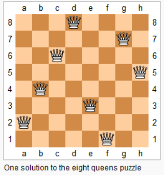

- [14.字典树和并查集](#14字典树和并查集)
  - [14.1.知识点](#141知识点)
  - [14.2.实战题目](#142实战题目)
    - [14.2.1.leedcode题目：102.二叉树的层序遍历](#1421leedcode题目102二叉树的层序遍历)
    - [14.2.2.leedcode题目：208.实现 Trie (前缀树)](#1422leedcode题目208实现-trie-前缀树)
    - [14.2.3.leedcode题目：212.单词搜索 II](#1423leedcode题目212单词搜索-ii)
    - [14.2.4.课后作业](#1424课后作业)
    - [14.2.5.leedcode题目：547.朋友圈](#1425leedcode题目547朋友圈)
    - [14.2.6.leedcode题目：200.岛屿数量](#1426leedcode题目200岛屿数量)
    - [14.2.7.leedcode题目：130.被围绕的区域](#1427leedcode题目130被围绕的区域)
- [15.高级搜索](#15高级搜索)
  - [15.1.知识点](#151知识点)
  - [15.2.实战题目](#152实战题目)
    - [15.2.1.leedcode题目：70.爬楼梯](#1521leedcode题目70爬楼梯)
    - [15.2.2.leedcode题目：22.括号生成](#1522leedcode题目22括号生成)
    - [15.2.3.leedcode题目：51.N 皇后](#1523leedcode题目51n-皇后)
    - [15.2.4.leedcode题目：36.有效的数独](#1524leedcode题目36有效的数独)
    - [15.2.5.leedcode题目：127.单词接龙](#1525leedcode题目127单词接龙)
    - [15.2.6.leedcode题目：433.最小基因变化](#1526leedcode题目433最小基因变化)
    - [15.2.7.课后作业](#1527课后作业)
    - [15.2.8.leedcode题目：1091.二进制矩阵中的最短路径](#1528leedcode题目1091二进制矩阵中的最短路径)
    - [15.2.9.leedcode题目：773.滑动谜题](#1529leedcode题目773滑动谜题)
    - [15.2.9.leedcode题目：37.解数独](#1529leedcode题目37解数独)
- [16.红黑树和AVL树](#16红黑树和avl树)
  - [16.1.知识点](#161知识点)


# 14.字典树和并查集

## 14.1.知识点

**1、字典树的数据结构**

基本结构：字典树，即trie树，又称单词查找树或键树，是一种树形结构。典型应用是用于统计和排序大量的字符串（但又不仅限于字符串），所以经常被搜索引擎系统用于文本词频统计。
优点是：最大限度地减少无谓的字符串比较，查询效率比哈希表高。

**基本性质**
+ 1、节点本身不存在完整单词
+ 2、从根节点到某一个节点，路径上经过的字符连接起来，为该节点对应的字符串
+ 3、每个节点的所有子节点路径代表的字符都不相同
  
**核心思想**
+ Trie树的核心思想是空间换时间
+ 利用字符串的公共前缀来降低查询时间的开销以达到提高效率的目的

[Trie树代码模板](https://shimo.im/docs/DP53Y6rOwN8MTCQH/read)

[并查集代码模板](https://shimo.im/docs/VtcxL0kyp04OBHak/read)

[并查集总结](并查集总结.md)

## 14.2.实战题目

### 14.2.1.leedcode题目：[102.二叉树的层序遍历](https://leetcode-cn.com/problems/binary-tree-level-order-traversal/)

### 14.2.2.leedcode题目：[208.实现 Trie (前缀树)](https://leetcode-cn.com/problems/implement-trie-prefix-tree/)
实现一个 Trie (前缀树)，包含 insert, search, 和 startsWith 这三个操作。
```java
示例:
Trie trie = new Trie();

trie.insert("apple");
trie.search("apple");   // 返回 true
trie.search("app");     // 返回 false
trie.startsWith("app"); // 返回 true
trie.insert("app");   
trie.search("app");     // 返回 true

说明:
你可以假设所有的输入都是由小写字母 a-z 构成的。
保证所有输入均为非空字符串。
```
**题解**
要实现Trie树，需要先设计TrieNode结点，结点应具有以下字段：
+ 最多R个指向子结点的链接，其中每个链接对应字母表数据集中的一个字母，本文中假定R为26，小写拉丁字母的数量。
+ 布尔字段，以指定节点是对应键的结尾还是只是前缀。
```java
//定义Trie树的节点结构
class TrieNode {
    //R links to node children
    private TrieNode[] links;
    private final int R = 26;
    private boolean isEnd;

    public TrieNode(){
        links = new TrieNode[R];
    }

    public boolean containsKey(char ch){
        return links[ch-'a'] != null;
    }

    public TrieNode get(char ch){
        return links[ch - 'a'];
    }

    public void put(char ch, TrieNode node){
        links[ch - 'a'] = node;
    }

    public void setEnd(){
        isEnd = true;
    }

    public boolean isEnd(){
        return isEnd;
    }
}
```
Trie树中最常见的两个操作：键的插入和查找
**向Trie树中插入键**
通过搜索Trie树来插入一个键。从根开始搜索它对应于第一个键字符的链接。有两种情况：
+ 链接存在。沿着链接移动到树的下一个子层。算法继续搜索下一个键字符
+ 链接不存在。创建一个新的节点，并将它与父节点的链接相连，该链接与当前的键字符相匹配。
重复以上步骤，直到到达键的最后一个字符，然后将当前节点标记为结束节点，算法完成。
时间复杂度：O(m)，空间复杂度：O(m)
```java
class Trie{
    private TrieNode root;

    public Trie(){
        root = new TrieNode();
    }

    //Insert a word into the trie
    public void insert(String word){
        TrieNode node = root;
        for (int i = 0; i < word.length(); i++){
            char currentChar = word.charAt(i);
            if (!node.containKey(currentChar)){
                node.put(currentChar, new TrieNode());
            } else {
                node = node.get(currentChar);
            }
        }
        node.setEnd();
    }
}
```
**在Trie树中查找键**
每个键在Trie中表示为从根到内部节点或叶的路径。用第一个键字符从根开始，检查当前节点中与键字符对应的链接。有两种情况：
+ 存在链接。移动到该链接后面路径中的下一个节点，并继续搜索下一个键字符。
+ 不存在链接。若已无键字符，且当前结点标记为isEnd，则返回true。否则有两种可能，均返回false：
  + 还有键字符剩余，但无法跟随Trie树的键路径，找不到键。
  + 没有键字符剩余，但当前结点没有标记为isEnd，也就是说，待查找键只是Trie树中另一个键的前缀。
时间复杂度：O(m)，空间复杂度O(1)
```java
class Trie{
    ...

    //search a prefix or whole key in trie and returns the node where search ends
    private TrieNode searchPrefix(String word){
        TrieNode node = root;
        for (int i = 0; i < word.length(); i++){
            char currentChar = word.charAt(i);
            if (node.containKey(currentChar)){
                node = node.get(currentChar);
            } else {
                return null;
            }
        }
        return node;
    }

    // Returns if the word is in the trie.
    public boolean search(String word){
        TrieNode node = searchPrefix(word);
        return node != null && node.isEnd();
    }
}
```
**查找trie树中的键前缀**
该方法与在 Trie 树中搜索键时使用的方法非常相似。我们从根遍历 Trie 树，直到键前缀中没有字符，或者无法用当前的键字符继续 Trie 中的路径。与上面提到的“搜索键”算法唯一的区别是，到达键前缀的末尾时，总是返回 true。我们不需要考虑当前 Trie 节点是否用 “isend” 标记，因为我们搜索的是键的前缀，而不是整个键。
时间复杂度：O(m)，空间复杂度O(1)
```java
class Trie{
    ...

    //return if there is any word in the trie that starts with given prefix
    public boolean startsWith(String prefix){
        TrieNode node = searchPrefix(prefix);
        return node != null;
    }
}
```

**并查集**
适用于组团配对问题（Group or not？）
详细请看 [并查集总结](并查集总结.md) 或 CSDN文章[并查集总结](https://blog.csdn.net/weixin_40403059/article/details/108546622)

**基本操作**
+ makeSet(s):建立一个新的并查集，其中包含s个单元素集合
+ unionSet(x,y)：把元素x和元素y所在的集合合并，要求x和y所在的几个不想交，如果相交则不合并。
+ find(x)：找到元素x所在的集合的代表，该操作也可以用于判断两个元素是否位于同一个集合，只要将它们各自的代表比较一下就可以了

```java
class UnionFind{
    private int count = 0;
    private int[] parent;
    public UnionFind(int n){
        count = n;
        parent = new int[n];
        for(int i = 0; i < n ; i++){
            parent[i] = i;
        }
    }

    public int find(int p){
        while (p != parent[p]){
            parent[p] = parent[parent[p]];
            p = parent[p];
        }
        return p;
    }
    public void union(int p, int q){
        int rootP = find(p);
        int rootQ = find(q);
        if(rootP == rootQ) return;
        parent[rootP] = rootQ;
        count--;
    }
}
```

### 14.2.3.leedcode题目：[212.单词搜索 II](https://leetcode-cn.com/problems/word-search-ii/)


### 14.2.4.课后作业
分析单词搜索 2 用 Tire 树方式实现的时间复杂度，请同学们提交在学习总结中。

### 14.2.5.leedcode题目：[547.朋友圈](https://leetcode-cn.com/problems/friend-circles/)
班上有 N 名学生。其中有些人是朋友，有些则不是。他们的友谊具有是传递性。如果已知 A 是 B 的朋友，B 是 C 的朋友，那么我们可以认为 A 也是 C 的朋友。所谓的朋友圈，是指所有朋友的集合。

给定一个 N * N 的矩阵 M，表示班级中学生之间的朋友关系。如果M[i][j] = 1，表示已知第 i 个和 j 个学生互为朋友关系，否则为不知道。你必须输出所有学生中的已知的朋友圈总数。
```java
示例 1：
输入：
[[1,1,0],
 [1,1,0],
 [0,0,1]]
输出：2 
解释：已知学生 0 和学生 1 互为朋友，他们在一个朋友圈。
第2个学生自己在一个朋友圈。所以返回 2 。

示例 2：
输入：
[[1,1,0],
 [1,1,1],
 [0,1,1]]
输出：1
解释：已知学生 0 和学生 1 互为朋友，学生 1 和学生 2 互为朋友，所以学生 0 和学生 2 也是朋友，所以他们三个在一个朋友圈，返回 1 。

提示：
1 <= N <= 200
M[i][i] == 1
M[i][j] == M[j][i]
```

**题解**

首先，我们获取并查集的节点数n，使用代码int n = M.length;

其次，使用节点数n创建并查集，UnionFind unionFind = new UnionFind(n);

接下来就是重点了，遍历二位数组M，因为朋友关系矩阵是主对角线全为1的对称矩阵，只需遍历不包含对角线的左下角的部分即可。当两个节点是朋友关系，即M[i][j] == 1时，就调用unionFind.union(i,j)，将 i 和 j 连接起来。遍历结束后，具有连通关系的节点已经都连接完毕，最后的连通分量count就是朋友圈数，返回这个数即可。
```java
class UnionFind{
    private int count;
    private int[] parent;
    private int[] size;

    public UnionFind(int n){
        this.count = n;
        parent = new int[n];
        size = new int[n];
        for (int i = 0; i < n; i++){
            parent[i] = i;
            size[i] = 1;
        }
    }

    private int find(int x){
        while (parent[x] != x ){
            x = parent[x];
        }
        return x;
    }

    public void union(int p, int q){
        int rootP = find(p);
        int rootQ = find(q);
        if (rootP == rootQ) return;

        if (size[rootP] > size[rootQ]){
            parent[rootQ] = rootP;
            size[rootP] += size[rootQ];

        } else {
            parent[rootP] = rootQ;
            size[rootQ] += size[rootP];
        }
        count--;
    }

    public int count(){
        return count;
    }

    public boolean connented(int p , int q){
        int rootP = find(p);
        int rootQ = find(q);
        return rootP == rootQ;
    }
}
class Solution{
    public int findCircleNum(int[][] M) {
        //获取节点数
        int n = M.length;
        //创建节点数为n的并查集
        UnionFind unionFind = new UnionFind(n);

        //遍历二位数组，M[i][j]
        for (int i = 0; i < n; i++){
            for (int j = 0; j < i; j++){
                if (M[i][j] == 1) {
                    unionFind.union(i,j);
                }
            }
        }
        return unionFind.count();
    }
}
```


### 14.2.6.leedcode题目：[200.岛屿数量](https://leetcode-cn.com/problems/number-of-islands/)
给你一个由 '1'（陆地）和 '0'（水）组成的的二维网格，请你计算网格中岛屿的数量。
岛屿总是被水包围，并且每座岛屿只能由水平方向或竖直方向上相邻的陆地连接形成。
此外，你可以假设该网格的四条边均被水包围。
```java
示例 1:
输入:
[
['1','1','1','1','0'],
['1','1','0','1','0'],
['1','1','0','0','0'],
['0','0','0','0','0']
]
输出: 1

示例 2:
输入:
[
['1','1','0','0','0'],
['1','1','0','0','0'],
['0','0','1','0','0'],
['0','0','0','1','1']
]
输出: 3
解释: 每座岛屿只能由水平和/或竖直方向上相邻的陆地连接而成。
```
**题解**
**并查集的解法**
```java
class UnionFind_2{
    private int count;
    private int[] parent;
    private int[] size;
    public UnionFind_2(char[][] grid){
        int m = grid.length;
        int n = grid[0].length;
        this.count = 0;
        parent = new int[m * n];
        size = new int[m * n];
        for (int i = 0; i < m; i++){
            for (int j = 0; j < n; j++) {
                if (grid[i][j] == '1'){
                    parent[i * n + j] = i * n + j;
                    count++;
                }
                size[i * n + j] = 1;
            }
        }
    }

    private int find(int p){
        int x = p;
        while (parent[x] != x){
            parent[x] = parent[parent[x]];
            x = parent[x];
        }
        return x;
    }

    public void union(int p, int q){
        int rootP = find(p);
        int rootQ = find(q);
        if (rootP == rootQ) return;
        if (size[rootP] > size[rootQ]){
            parent[rootQ] = rootP;
            size[rootP] += size[rootQ];
        } else {
            parent[rootP] = rootQ;
            size[rootQ] += size[rootP];
        }
        count--;
    }

    public boolean connected(int p,int q){
        int rootP = find(p);
        int rootQ = find(q);
        return rootP == rootQ;
    }

    public int getCount(){
        return count;
    }
}

public class Solution {
    public int numIslands(char[][] grid) {
        if (grid == null || grid.length == 0){
            return 0;
        }
        int m = grid.length;
        int n = grid[0].length;
        //System.out.println(n);
        UnionFind_2 unionFind_2 = new UnionFind_2(grid);
        for (int i = 0; i < m; i++){
            for (int j = 0; j < n; j++){
                if (grid[i][j] == '1'){
                    grid[i][j] = '0';
                    if (i - 1 >= 0 && grid[i-1][j] == '1') unionFind_2.union(i*n+j, (i-1)*n+j);
                    if (i + 1 < m && grid[i+1][j] == '1') unionFind_2.union(i*n+j, (i+1)*n+j);
                    if (j - 1 >= 0 && grid[i][j-1] == '1') unionFind_2.union(i*n+j, i*n+(j-1));
                    if (j + 1 < n && grid[i][j+1] == '1') unionFind_2.union(i*n+j, i*n+(j+1));
                }
            }
        }
        return unionFind_2.getCount();
    }
}
```


### 14.2.7.leedcode题目：[130.被围绕的区域](https://leetcode-cn.com/problems/surrounded-regions/)

# 15.高级搜索

## 15.1.知识点

**初级搜索**

+ 1、朴素搜索
+ 2、优化方式：不重复（fibonacci）、剪枝（生成括号问题）
+ 3、搜索方向
  + DFS：depth first search 深度优先搜索
  + BFS：breadth first search 广度优先搜索
  + 双向搜索、启发式搜索

**剪枝**
**回溯法**
回溯法采用试错的思想，它尝试分步的去解决一个问题。在分步解决问题的过程中，当它通过尝试发现现有的分步答案不能得到有效的额正确的解答的时候，它将取消上一步甚至上几步的计算，在通过其他的可能的分步解答再次尝试寻找问题的答案。

回溯法通常用最简单的递归方式来实现，在反复重复上述的步骤后，可能出现两种情况：
+ 找到一个可能存在的正确的答案
+ 在尝试了所有可能的分步方法后，宣告该问题没有答案

最坏的情况下，回溯法会导致一次复杂度为指数时间的计算

回溯法的模板
```java

```

[DFS代码模板](https://shimo.im/docs/UdY2UUKtliYXmk8t/read)
[BFS代码模板](https://shimo.im/docs/ZBghMEZWix0Lc2jQ/read)
[AlphaZero Explained](https://nikcheerla.github.io/deeplearningschool/2018/01/01/AlphaZero-Explained/)
[棋类复杂度](https://en.wikipedia.org/wiki/Game_complexity)
[A*代码模板](https://shimo.im/docs/8CzMlrcvbWwFXA8r/read)
[相似度测量方法](https://dataaspirant.com/five-most-popular-similarity-measures-implementation-in-python/)
[8 puzzles解法比较](https://zxi.mytechroad.com/blog/searching/8-puzzles-bidirectional-astar-vs-bidirectional-bfs/)


## 15.2.实战题目

### 15.2.1.leedcode题目：[70.爬楼梯](https://leetcode-cn.com/problems/climbing-stairs/)


### 15.2.2.leedcode题目：[22.括号生成](https://leetcode-cn.com/problems/generate-parentheses/)


### 15.2.3.leedcode题目：[51.N 皇后](https://leetcode-cn.com/problems/n-queens/)
n 皇后问题研究的是如何将 n 个皇后放置在 n×n 的棋盘上，并且使皇后彼此之间不能相互攻击。

上图为 8 皇后问题的一种解法。

给定一个整数 n，返回所有不同的 n 皇后问题的解决方案。

每一种解法包含一个明确的 n 皇后问题的棋子放置方案，该方案中 'Q' 和 '.' 分别代表了皇后和空位。
```java
示例：
输入：4
输出：[
 [".Q..",  // 解法 1
  "...Q",
  "Q...",
  "..Q."],

 ["..Q.",  // 解法 2
  "Q...",
  "...Q",
  ".Q.."]
]
解释: 4 皇后问题存在两个不同的解法。

提示：
皇后彼此不能相互攻击，也就是说：任何两个皇后都不能处于同一条横行、纵行或斜线上。
```
**题解**

```python
def solveNQueens(self,n):
    if n < 1: return [];
    self.restult = []
    self.cols = set()
    self.pie = set()
    self.na = set()
    self.DFS(n,0,[])
    return self._generate_result(n)

def DFS(self,n,row,cur_state):
    # recurasion terminator
    if row >= n:
        self.result.append(cur_state)
        return 
    
    for col in range(n):
        if col in self.cols or row + col in self.pie or row - col in self.na:
        # go die
        continue
    
    # updata the flags
    self.cols.add(col)
    self.pie.add(row + col)
    self.na.add(roe - col)

    self.DFS(n, row + 1, cur_state + [col])

    self.cols.remove(col)
    self.pie.remove(row + col)
    self.na.remove(row - col)

```

### 15.2.4.leedcode题目：[36.有效的数独](https://leetcode-cn.com/problems/valid-sudoku/description/)


### 15.2.5.leedcode题目：[127.单词接龙](https://leetcode-cn.com/problems/word-ladder/)


### 15.2.6.leedcode题目：[433.最小基因变化](https://leetcode-cn.com/problems/minimum-genetic-mutation/)


### 15.2.7.课后作业
总结双向 BFS 代码模版，请同学们提交在学习总结中。

### 15.2.8.leedcode题目：[1091.二进制矩阵中的最短路径](https://leetcode.com/problems/shortest-path-in-binary-matrix/discuss/313347/A*-search-in-Python)


### 15.2.9.leedcode题目：[773.滑动谜题](https://leetcode-cn.com/problems/sliding-puzzle/)


### 15.2.9.leedcode题目：[37.解数独](https://leetcode-cn.com/problems/sudoku-solver/)


# 16.红黑树和AVL树

## 16.1.知识点

**树 Tree** 
**二叉树 Binary Tree**
**二叉树的遍历**
+ 1、前序（Pre-order）：根-左-右
+ 2、中序（In-order）：左-根-右
+ 3、后续（Post-order）：左-右-根

**二叉搜索树 Binary Search Tree**

**保证性能的关键**
+ 1.保证二维维度！—>   左右子树结点平衡（recursively）
+ 2.Balanced
+ 3.https://en.wikipedia.org/wiki/Self-balancing_binary_search_tree

[维基百科：平衡树](https://en.wikipedia.org/wiki/Self-balancing_binary_search_tree)


**AVL树**
+ 1、发明者G. M. Adelson 和 Evgenii Landis
+ 2、Balance Factor（平衡因子）
  + 是它的左子树的高度减去它的右子树的高度（有时相反）
  + balance factor = {-1，0，1}
  + 通过旋转操作来进行平衡（四种）

**旋转操作**
+ 左旋
+ 右旋
+ 左右旋
+ 右左旋

子树形态：右右子树 --> 左旋
子树形态：左左子树 --> 右旋
子树形态：左右子树 --> 左右旋
子树形态：右左子树 --> 右左旋

带子树的旋转

**AVL总结**
+ 1、平衡二叉搜索树
+ 2、每个结点存 balance factor = {-1，0，1}
+ 3、四种旋转操作

不足：结点需要存储额外的信息，且调整次数频繁


**红黑树(Red-Black Tree)**

红黑树是一种**近似平衡**的二叉搜索树（BinarySearch Tree），它能够确保任何一个结点的左右子树的**高度差小于两倍**。具体来说，红黑树是满足如下条件的二叉搜索树：
+ 每个结点要么是红色，要么是黑色
+ 根结点是黑色
+ 每个叶结点（NIL结点，空结点）是黑色的。
+ 不能有相邻接的两个红色结点
+ 从任一结点到其每个叶子的所有路径都包含相同数目的黑色结点

**关键性质**
从根到叶子的最长的可能路径不多于最短的可能路径的两倍长。关键性质

**红黑树和AVL对比**
+ AVL trees provide **faster lookups** than Red Black Trees because they are **more strictly balanced**.
+ Red Black Trees provide **faster insertion and removal** operations than AVL trees as fewer rotations are done due to relatively relaxed balancing.
+ AVL trees store balance **factors or heights** with each node, thus requires storage for an integer per node whereas Red Black Tree requires only 1 bit of information per node.
+ Red Black Trees are used in most of the **language libraries likemap,multimap,multisetin C++** whereas AVL trees are used in **databases** where faster retrievals are required.


