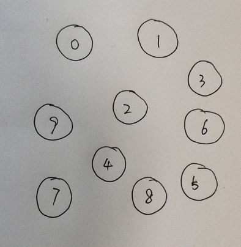
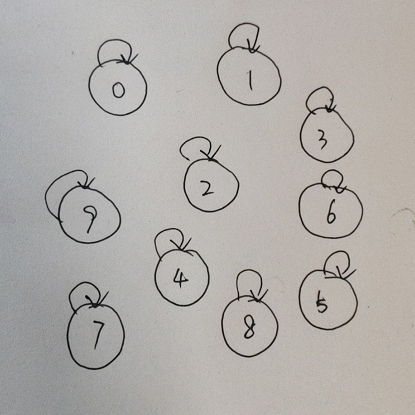
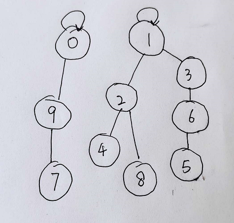
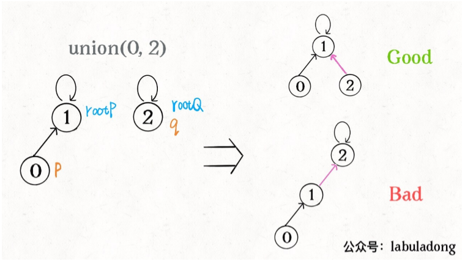
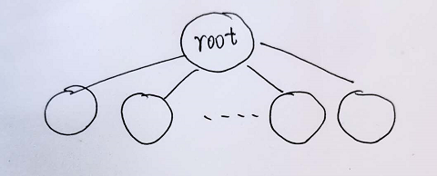
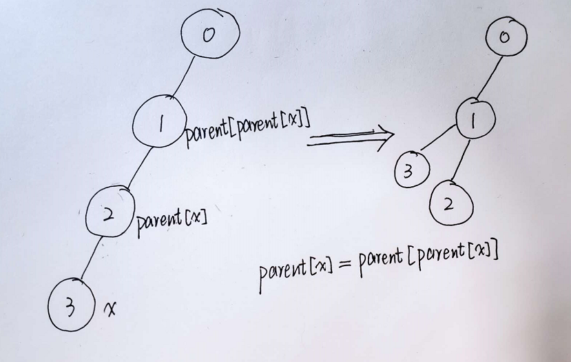

- [并查集](#并查集)
  - [一、动态连通性](#一动态连通性)
  - [二、实现思路](#二实现思路)
  - [三、优化代码](#三优化代码)
  - [四、路径压缩](#四路径压缩)
  - [五、总结一下](#五总结一下)
  - [六、并查集的应用](#六并查集的应用)
  - [写在最后](#写在最后)

# 并查集
关于并查集看到一个有意思的解释，可以很好的帮助理解并查集。[并查集详解（超级简单有趣~~就学会了）](https://blog.csdn.net/qq_41593380/article/details/81146850?biz_id=102&utm_term=%E5%B9%B6%E6%9F%A5%E9%9B%86&utm_medium=distribute.pc_search_result.none-task-blog-2~all~sobaiduweb~default-0-81146850&spm=1018.2118.3001.4187
)
还有一篇文章对并查集有很详细的解释，写的清楚明白，[Union-Find算法详解](http://labuladong.gitbook.io/algo/gao-pin-mian-shi-xi-lie/unionfind-suan-fa-xiang-jie)。

根据这两篇文章的内容，写写自己的理解。


## 一、动态连通性

先解释下什么叫做动态连通性。

动态连通性就是把原来相互独立的节点，通过某一种【等价关系】将两个节点连接起来。这里的【等价关系】就被成为“连通”。
一般等价关系都具有三个性质：
+ 自反性：节点 p 和 p 是连通的；
+ 对称性：如果节点 p 和 q 连通，那么 q 和 p 也连通；
+ 传递性：如果节点 p 和 q 连通，q 和 r 连通，那么 p 和 r 连通。
  
Union-find算法主要要实现这两个API：
```java
class UnionFind{
    //将p和q连接
    public void union(int p,int q);
    //判断p和q是否连通
    public boolean connected(int p,int q);
    //返回图中有多少连通分量
    public int count();
}
```

举个例子：
假设有一个很大很大的湖，这个湖里有10个小岛，给这些岛从0~9编号。开始的时候，这10个小岛两两之间都没有桥，人无法通过步行从一个岛上走到另一个岛上（请不要考虑船之类的水上交通工具或者岛之间的距离，这里只是为了说明意思），那么这10个岛就是相互独立的，就可以说这10个岛都是不连通的。

Union-find算法中需要实现的方法可以这么理解：
+ union表示：连接节点p和q，就是在两个岛之间建立一座桥，让两个岛之间建立连接。
+ connected表示：判断两个岛之间是否建立了连接，建立了连接就返回true，否则返回false。
+ count表示：记录湖中有几块岛屿是独立的。
_注意，如果岛1和岛2之间建了桥，即调用union(1,2)建立连接，那么人就可以通过桥步行从岛1走到岛2上，岛1和岛2就不是独立的。岛3和岛1、岛2都没有建桥，那么岛3和岛1岛2之间就是独立的。_

在开始的情况下，10个岛之间都没有建立连接，调用connected都会返回false，独立的岛屿数是10个，即连通分量是10。

现在调用union(0,1)，即岛0和岛1建立了连接，connected(0,1)就会返回true，连通分量降为9。
再调用union(1,2)，这时岛0、岛1、岛2之间建立了连接，connected(0,2)也会返回true，连通分量会降为8.

## 二、实现思路

我们把这个10个岛画在纸上


为了表示连通性，我们需要给每个节点设置一个指针，指向它的父亲节点，不需要复杂的数据结构，只需要创建一个长度为n的数组parent[]，这里的n指的是节点数。
parent[i] = j 表示：节点 i 的父亲节点是 j 。
如果是根节点，它的指针就指向自己，即parent[root] = root;
例如：开始时，各个岛屿都是相互独立的，那么各个节点的指针都是指向自己的


创建UnionFind，并初始化
```java
class UnionFind{
    //记录连通分量
    private int count;
    //记录父亲节点的数组，节点x的父亲节点是parent[x]
    private int[] parent;

    //构造函数，n为节点总数，即初始状态
    public UnionFind(int n){
        //开始互相之间都不连通,连通量为n
        this.count = n;
        //初始的时候，各个节点的父亲节点都是自己，所以parent[i]=i
        parent = new int[n];
        for (int i = 0; i < n; i++){
            parent[i] = i;
        }
    }

    //...
}
```
假如我们希望两个节点之间是连通，只需要让其中一个节点的父亲节点设为另一个节点即可，就是说，假设连通节点p和q，令parent[p] = q，多次连接之后，就会发现，连通的部分就像一棵树，如图

当我们希望两个节点连通，也可以让一个节点的根节点连接到另外一个节点的根节点上即可，这样的话，我们首先需要找到这两个节点的根节点（注意：一个节点的根节点不一定是这个节点的父亲节点，可能是它的爷爷的爷爷...节点，直到找到那个父亲节点是自己的节点），让其中一个根节点成为另一个根节点的父亲节点。
```java
//查找节点x的根节点,如果x的父亲节点不是x本身，那么就将x的父亲节点赋值给x，一层一层地向上找，直到x的父亲节点是x本身，即parent[x] = x
private int find(int x){
    while(parent[x] != x ){
        x = parent[x];
    }
    return x;
}
//找到p,q的根节点，如果两者的根节点相同，说明两者已经是连通的了，无需再连通，直接返回；如果两个根节点不是同一个，那么将其中一个根节点连接到另外一个节点上，即让其中一个节点的父亲节点等于另一个节点
public void union(int p, int q){
    int rootP = find(p);
    int rootQ = find(q);
    if (rootP == rootQ) return;
    //将rootP的父亲节点设置为rootQ
    parent[rootP] = rootQ;
    //将两个互相独立的岛屿，连接到一起，那么连通分量就会少一，即count--；
    count--;
}
//返回当前的连通分量个数
public int count(){
    return count;
}
```
至于connected的实现，如果节点p和节点q连通，那么他们肯定具有相同的根节点，即
```java
public boolean connented(int p , int q){
    int rootP = find(p);
    int rootQ = find(q);
    return rootP == rootQ;
}
```
基本上，Union-Find的算法算是基本完成了。

关于复杂度，我们可以看到union和connected的复杂度基本来源于find，find从某个子节点向上查找根节点时，其时间复杂度就是树的高度，最坏的情况下是树退化成一个链表，需要遍历所有节点，时间复杂度是O(n)的。这个复杂度并不是很好，我们期望可以降低复杂度。既然时间复杂度是树的高度，那么如果树是比较平衡点的结构，那么复杂度是不是就降低了呢？

## 三、优化代码

我们可以看出，导致树结构不平衡的情况是，我们利用union函数，暴力地将节点 p 所在的树连通到节点 q 的根节点上，并没有注意树结构是否平衡，容易造成某一分支过长的情况。
借用labuladong的一幅图

长此以往，树只会越来越不平衡，labuladong的详解里写到，采用一个数组来记录树的‘重量’，即树的节点数。在连接根节点的时候，比较下树的节点数，节点数较小的树连接到节点数较大的树的下面，可以避免不平衡的情况。
```java
class UnionFind{
    //记录连通分量
    private int count;
    //记录父亲节点的数组，节点x的父亲节点是parent[x]
    private int[] parent;
    //记录树的节点数，size[3]=5表示，以3为根节点的树共有5个节点
    private int[] size;

    //构造函数，n为节点总数，即初始状态
    public UnionFind(int n){
        //开始互相之间都不连通,连通数为n
        this.count = n;
        //初始的时候，各个节点的父亲节点都是自己，所以parent[i]=i
        //初始化时的每个节点的节点数都是1
        parent = new int[n];
        size = new int[n];
        for (int i = 0; i < n; i++){
            parent[i] = i;
            size[i] = 1;
        }
    }

    //...
}
```
union可修改为：
```java
//找到p,q的根节点，如果两者的根节点相同，说明两者已经是连通的了，无需再连通，直接返回；如果两个根节点不是同一个，将节点数较少的根节点连接到节点数较多的节点上
public void union(int p, int q){
    int rootP = find(p);
    int rootQ = find(q);
    if (rootP == rootQ) return;
    //判断节点数，将节点数较少的根节点连接到节点数较多的节点上
    if (size[rootP] > size[rootQ]){
        //rootP的节点数大于rootQ的节点数，将rootQ的父亲节点设为rootP
        parent[rootQ] = rootP;
        //rootQ成为了rootP的一部分，那么将rootQ的节点数加到rootP上
        size[rootP] += size[rootQ];

    } else {
        //rootQ的节点数大于rootP的节点数，将rootP的父亲节点设为rootQ
        parent[rootP] = rootQ;
        size[rootQ] += size[rootP];
    }
    //将两个互相独立的岛屿，连接到一起，那么连通分量就会少一，即count--；
    count--;
}
```
通过比较树的重量，让树尽可能的平衡，降低了时间复杂度。

## 四、路径压缩

既然find的时间复杂度是树的高度，可不可以有一种方式将树的高度降到最低？比如说n个节点的树，高度为2，叶子节点为n-1，就像这样


这样find查找的时间复杂度为常数级的，find、union、connected的时间复杂度都为O(1)了，是比较理想的情况。
优化思路是，如果x的父亲节点不是x本身，那么将x的爷爷节点赋值给x的父亲节点，如图所示，节点3的父亲节点是2，爷爷节点是1，运行parent[x] = parent[parent[x]]这行代码，就是将节点3的爷爷节点1变成了节点3的父亲节点，其中如果该节点的父亲节点正好是根节点，因为根节点的父亲节点还是本身，其父亲节点的父亲节点并不会出错，仍然是有效的，还是根节点，不会发生越界问题。而 x = parent[x]是将x的父亲节点赋值给x，是为了一层一层地往上找根节点。


代码如下；
```java
//查找节点x的根节点,如果x的父亲节点不是x本身，将x连接到x的爷爷节点上，再将x的父亲节点赋值给x，一层一层地向上找，直到x的父亲节点是x本身，即parent[x] = x
private int find(int x){
    while(parent[x] != x ){
        parent[x] = parent[parent[x]];
        x = parent[x];
    }
    return x;
}
```
每次运行find，都会进行一次压缩，一般来讲，树的高度不会变得很大，还是比较可行的。

## 五、总结一下

总的代码如下
```java
class UnionFind{
    //记录连通分量
    private int count;
    //记录父亲节点的数组，节点x的父亲节点是parent[x]
    private int[] parent;
    //记录树的节点数，size[3]=5表示，以3为根节点的树共有5个节点
    private int[] size;

    //构造函数，n为节点总数，即初始状态
    public UnionFind(int n){
        //开始互相之间都不连通,连通数为n
        this.count = n;
        //初始的时候，各个节点的父亲节点都是自己，所以parent[i]=i
        //初始化时的每个节点的节点数都是1
        parent = new int[n];
        size = new int[n];
        for (int i = 0; i < n; i++){
            parent[i] = i;
            size[i] = 1;
        }
    }
    //查找节点x的根节点,如果x的父亲节点不是x本身，将x连接到x的爷爷节点上，再将x的父亲节点赋值给x，一层一层地向上找，直到x的父亲节点是x本身，即parent[x] = x
    private int find(int x){
        while(parent[x] != x ){
            x = parent[x];
        }
        return x;
    }
    //找到p,q的根节点，如果两者的根节点相同，说明两者已经是连通的了，无需再连通，直接返回；如果两个根节点不是同一个，将节点数较少的根节点连接到节点数较多的节点上
    public void union(int p, int q){
        int rootP = find(p);
        int rootQ = find(q);
        if (rootP == rootQ) return;
        //判断节点数，将节点数较少的根节点连接到节点数较多的节点上
        if (size[rootP] > size[rootQ]){
            //rootP的节点数大于rootQ的节点数，将rootQ的父亲节点设为rootP
            parent[rootQ] = rootP;
            //rootQ成为了rootP的一部分，那么将rootQ的节点数加到rootP上
            size[rootP] += size[rootQ];

        } else {
            //rootQ的节点数大于rootP的节点数，将rootP的父亲节点设为rootQ
            parent[rootP] = rootQ;
            size[rootQ] += size[rootP];
        }
        //将两个互相独立的岛屿，连接到一起，那么连通分量就会少一，即count--；
        count--;
    }
    //返回当前的连通分量个数
    public int count(){
        return count;
    }

    public boolean connented(int p , int q){
        int rootP = find(p);
        int rootQ = find(q);
        return rootP == rootQ;
    }
}
```

## 六、并查集的应用

了解了并查集的原理，我们试着使用并查集解决问题

并查集，顾名思义，合并再查找，解决Group or not问题的利器。下面我们以leedcode中朋友圈题目为例。

[点这里](https://leetcode-cn.com/problems/friend-circles/)，查看leedcode原题。

547. 朋友圈
班上有 N 名学生。其中有些人是朋友，有些则不是。他们的友谊具有是传递性。如果已知 A 是 B 的朋友，B 是 C 的朋友，那么我们可以认为 A 也是 C 的朋友。所谓的朋友圈，是指所有朋友的集合。

给定一个 N * N 的矩阵 M，表示班级中学生之间的朋友关系。如果M[i][j] = 1，表示已知第 i 个和 j 个学生互为朋友关系，否则为不知道。你必须输出所有学生中的已知的朋友圈总数。

```java
示例 1：
输入：
[[1,1,0],
 [1,1,0],
 [0,0,1]]
输出：2 
解释：已知学生 0 和学生 1 互为朋友，他们在一个朋友圈。
第2个学生自己在一个朋友圈。所以返回 2 。

示例 2：
输入：
[[1,1,0],
 [1,1,1],
 [0,1,1]]
输出：1
解释：已知学生 0 和学生 1 互为朋友，学生 1 和学生 2 互为朋友，所以学生 0 和学生 2 也是朋友，所以他们三个在一个朋友圈，返回 1 。

提示：
1 <= N <= 200
M[i][i] == 1
M[i][j] == M[j][i]
```

**题目解析**

这个问题还有别的解法，这里我们只使用并查集的解法。

把N名学生看成是不同的节点，节点之间的连通关系是彼此是朋友关系，可以看到，这个【朋友关系】是一种等价关系，满足等价关系的性质：自反性，对称性，传递性。表达这个关系的矩阵M必然是一个主对角线全为1的对称矩阵。

题目要求输出所有学生中的已知的朋友圈总数。如果我们把彼此之间是【朋友关系】的节点连接在一起，那个连通分量count就是“朋友圈的总数”。那么怎么使用并查集将是朋友关系的节点连通到一起呢？

先将前面写的UnionFind类复制过来，再创建一个findCircleNum(int[][] M)方法
```java
class UnionFind{
    private int count;
    private int[] parent;
    private int[] size;

    public UnionFind(int n){
        this.count = n;
        parent = new int[n];
        size = new int[n];
        for (int i = 0; i < n; i++){
            parent[i] = i;
            size[i] = 1;
        }
    }

    private int find(int x){
        while (parent[x] != x ){
            x = parent[x];
        }
        return x;
    }

    public void union(int p, int q){
        int rootP = find(p);
        int rootQ = find(q);
        if (rootP == rootQ) return;

        if (size[rootP] > size[rootQ]){
            parent[rootQ] = rootP;
            size[rootP] += size[rootQ];

        } else {
            parent[rootP] = rootQ;
            size[rootQ] += size[rootP];
        }
        count--;
    }

    public int count(){
        return count;
    }

    public boolean connented(int p , int q){
        int rootP = find(p);
        int rootQ = find(q);
        return rootP == rootQ;
    }
}

class Solution547{
    public int findCircleNum(int[][] M) {
        //...
    }
}
```
为了方便书写，我们把findCircleNum函数单独拿出来分析.
首先，我们获取并查集的节点数n，使用代码int n = M.length;
其次，使用节点数n创建并查集，UnionFind unionFind = new UnionFind(n);
接下来就是重点了，遍历二位数组M，因为朋友关系矩阵是主对角线全为1的对称矩阵，只需遍历不包含对角线的左下角的部分即可。当两个节点是朋友关系，即M[i][j] == 1时，就调用unionFind.union(i,j)，将 i 和 j 连接起来。遍历结束后，具有连通关系的节点已经都连接完毕，最后的连通分量count就是朋友圈数，返回这个数即可。
```java
public int findCircleNum(int[][] M) {
     //获取节点数
    int n = M.length;
    //创建节点数为n的并查集
    UnionFind unionFind = new UnionFind(n);

    //遍历二位数组，M[i][j]
    for (int i = 0; i < n; i++){
        for (int j = 0; j < i; j++){
            if (M[i][j] == 1) {
                unionFind.union(i,j);
            }
        }
    }
    return unionFind.count();
}
```
最后的最后，将两个类写到一起就是这个题目的解了，如下，
```java
class UnionFind{
    private int count;
    private int[] parent;
    private int[] size;

    public UnionFind(int n){
        this.count = n;
        parent = new int[n];
        size = new int[n];
        for (int i = 0; i < n; i++){
            parent[i] = i;
            size[i] = 1;
        }
    }

    private int find(int x){
        while (parent[x] != x ){
            x = parent[x];
        }
        return x;
    }

    public void union(int p, int q){
        int rootP = find(p);
        int rootQ = find(q);
        if (rootP == rootQ) return;

        if (size[rootP] > size[rootQ]){
            parent[rootQ] = rootP;
            size[rootP] += size[rootQ];

        } else {
            parent[rootP] = rootQ;
            size[rootQ] += size[rootP];
        }
        count--;
    }

    public int count(){
        return count;
    }

    public boolean connented(int p , int q){
        int rootP = find(p);
        int rootQ = find(q);
        return rootP == rootQ;
    }
}
class Solution{
    public int findCircleNum(int[][] M) {
        //获取节点数
        int n = M.length;
        //创建节点数为n的并查集
        UnionFind unionFind = new UnionFind(n);

        //遍历二位数组，M[i][j]
        for (int i = 0; i < n; i++){
            for (int j = 0; j < i; j++){
                if (M[i][j] == 1) {
                    unionFind.union(i,j);
                }
            }
        }
        return unionFind.count();
    }
}
```

## 写在最后

文章前面分析的代码大多是在文档里直接手敲，可能存在拼写错误，敬请谅解。但最后总结的代码在ide下调试过，并且在leedcode中执行通过，这部分是不会哟拼写错误的。


学会了使用并查集，那么一类问题都有了比较简单的解法，在leedcode题库里还有很多这类的题目，后续会加上。

以上内容是笔者参考上面两篇文章，加上自己理解书写的总结，如有不同见解，欢迎评论区讨论。