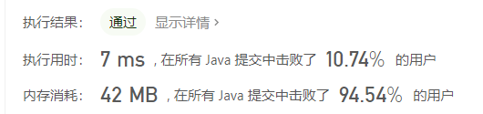
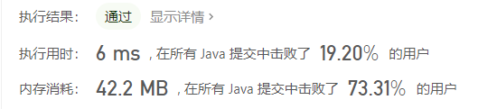

- [并查集的应用](#并查集的应用)
  - [第一题：200.岛屿数量](#第一题200岛屿数量)

# 并查集的应用

上篇文章我们了解了并查集的介绍，[点这里](https://blog.csdn.net/weixin_40403059/article/details/108546622)，这篇文章主要以leedcode题库中的两道题，来说下并查集的应用。

## 第一题：[200.岛屿数量](https://leetcode-cn.com/problems/number-of-islands/)

给你一个由 '1'（陆地）和 '0'（水）组成的的二维网格，请你计算网格中岛屿的数量。

岛屿总是被水包围，并且每座岛屿只能由**水平方向或竖直方向**上相邻的陆地连接形成。

此外，你可以假设该网格的四条边均被水包围。

```java
示例 1:
输入:
[
['1','1','1','1','0'],
['1','1','0','1','0'],
['1','1','0','0','0'],
['0','0','0','0','0']
]
输出: 1

示例 2:
输入:
[
['1','1','0','0','0'],
['1','1','0','0','0'],
['0','0','1','0','0'],
['0','0','0','1','1']
]
输出: 3
解释: 每座岛屿只能由水平和/或竖直方向上相邻的陆地连接而成。
```
**题目分析**

此题目还有别的解法，这里我们只讨论并查集的解法。

这个问题跟 [547.朋友圈](https://leetcode-cn.com/problems/friend-circles/)（如没有看过朋友圈问题，可以查看[并查集总结](https://blog.csdn.net/weixin_40403059/article/details/108546622)，有朋友圈问题的介绍）是有一些区别的，朋友圈问题的二维矩阵是主队对角线全为1的对称矩阵，是横纵两列都是代表的学生的编号，且横纵编号对应相同的编号是同一个人，就以一个个体人为节点，使用UnionFind算法。

但这个岛屿问题的二维矩阵，横纵坐标更像是经纬度，横纵编号没有特定的相同之处，那么这个题目是否可以使用并查集求解呢？

答案是肯定的。

如果在这里我们以二维矩阵中的每一个元素作为一个节点，那么等价关系就可以是：如果这个节点值是“1”，与这个节点的上下左右相邻的节点值也是“1”。这样想的等价关系，就可以使用并查集了。

如果还想不通，还记得上篇文章举的例子吗？

如果人步行就可以从一个岛屿走到另一个岛屿，我们就可以说这两个岛屿是连通的。那么这里我们把每个值是“1”的节点，想象成目前是独立的岛屿，而如果两个岛屿之间是上下左右相邻的话，就相当于在这两者之间建立了桥，这样就可以连通起来，视为一个岛屿。

是不是一下子就想到可以用并查集求解了呢？

相较上篇文章，UnionFind类里一些方法就需要修正一下:

首先是初始化时的构造函数

由于我们计划使用二维矩阵中每个元素作为节点，那么传入的参数可以直接使用二维矩阵grid[][]。

这里有个关键之处就是count，连通分量的计数器，在这里初始化的值应该是开始时“互相独立”的岛屿，即节点数为“1”的节点总数，是通过先设count=0；再遍历整个二维数组，如果节点值为“1”，就count加1，就正好是节点值为“1”的节点总数了。

这里还有一个点，就是parent数组，采用一维数组就可以记录某节点的父亲节点，采用二维位置与一维下标一一对应即可，这里使用 i * grid[0].length + j.

代码如下：

```java
class UnionFind_2{
    private int count;
    private int[] parent;
    private int[] size;
    public UnionFind_2(char[][] grid){
        int m = grid.length;
        int n = grid[0].length;
        this.count = 0;
        parent = new int[m * n];
        size = new int[m * n];
        for (int i = 0; i < m; i++){
            for (int j = 0; j < n; j++) {
                if (grid[i][j] == '1'){
                    parent[i * n + j] = i * n + j;
                    count++;
                }
                size[i * n + j] = 1;
            }
        }
    }

    //...
}
```

UnionFind类中其他方法没有改变，如下

```java
private int find(int p){
    int x = p;
    while (parent[x] != x){
        parent[x] = parent[parent[x]];
        x = parent[x];
    }
    return x;
}

public void union(int p, int q){
    int rootP = find(p);
    int rootQ = find(q);
    if (rootP == rootQ) return;
    if (size[rootP] > size[rootQ]){
        parent[rootQ] = rootP;
        size[rootP] += size[rootQ];
    } else {
        parent[rootP] = rootQ;
        size[rootQ] += size[rootP];
    }
    count--;
}

public boolean connected(int p,int q){
    int rootP = find(p);
    int rootQ = find(q);
    return rootP == rootQ;
}

public int getCount(){
    return count;
}
```


创建Solution类，并创建 numIslands(char[][] grit) 方法：

_注意：在朋友圈问题中，题目中已经给出了提示：1 <= N <= 200，本题没有关于值范围的提示，就需要考虑basecase了，当 grid == null 或者 grid.length == 0 时，没有岛屿，返回0；

创建并查集对象后，遍历二维数组grid，如果grid[i][j] == 1，为了避免重复遍历，先将这个节点值改为“0”，再判断这个节点上下左右节点是否也为“1”，如果是，合并这两个节点。

遍历结束，返回连通分量的个数，即return unionFind_2.getCount();


```java
public class Solution {
    public int numIslands(char[][] grid) {
        //当 grid == null 或者 grid.length == 0 时，没有岛屿，返回0；
        if (grid == null || grid.length == 0){
            return 0;
        }
        //获取二维数组的行数和列数
        int m = grid.length;
        int n = grid[0].length;
        UnionFind_2 unionFind_2 = new UnionFind_2(grid);

        //遍历这个二维数据，如果grid
        for (int i = 0; i < m; i++){
            for (int j = 0; j < n; j++){
                if (grid[i][j] == '1'){
                    grid[i][j] = '0';
                    if (i - 1 >= 0 && grid[i-1][j] == '1') unionFind_2.union(i*n+j, (i-1)*n+j);
                    if (i + 1 < m && grid[i+1][j] == '1') unionFind_2.union(i*n+j, (i+1)*n+j);
                    if (j - 1 >= 0 && grid[i][j-1] == '1') unionFind_2.union(i*n+j, i*n+(j-1));
                    if (j + 1 < n && grid[i][j+1] == '1') unionFind_2.union(i*n+j, i*n+(j+1));
                }
            }
        }
        return unionFind_2.getCount();
    }
}
```

总结在一下，代码如下：
```java
class UnionFind_2{
    private int count;
    private int[] parent;
    private int[] size;
    public UnionFind_2(char[][] grid){
        int m = grid.length;
        int n = grid[0].length;
        this.count = 0;
        parent = new int[m * n];
        size = new int[m * n];
        for (int i = 0; i < m; i++){
            for (int j = 0; j < n; j++) {
                if (grid[i][j] == '1'){
                    parent[i * n + j] = i * n + j;
                    count++;
                }
                size[i * n + j] = 1;
            }
        }
    }

    private int find(int p){
        int x = p;
        while (parent[x] != x){
            parent[x] = parent[parent[x]];
            x = parent[x];
        }
        return x;
    }

    public void union(int p, int q){
        int rootP = find(p);
        int rootQ = find(q);
        if (rootP == rootQ) return;
        if (size[rootP] > size[rootQ]){
            parent[rootQ] = rootP;
            size[rootP] += size[rootQ];
        } else {
            parent[rootP] = rootQ;
            size[rootQ] += size[rootP];
        }
        count--;
    }

    public boolean connected(int p,int q){
        int rootP = find(p);
        int rootQ = find(q);
        return rootP == rootQ;
    }

    public int getCount(){
        return count;
    }
}

public class Solution {
    public int numIslands(char[][] grid) {
        if (grid == null || grid.length == 0){
            return 0;
        }
        int m = grid.length;
        int n = grid[0].length;
        UnionFind_2 unionFind_2 = new UnionFind_2(grid);
        for (int i = 0; i < m; i++){
            for (int j = 0; j < n; j++){
                if (grid[i][j] == '1'){
                    grid[i][j] = '0';
                    if (i - 1 >= 0 && grid[i-1][j] == '1') unionFind_2.union(i*n+j, (i-1)*n+j);
                    if (i + 1 < m && grid[i+1][j] == '1') unionFind_2.union(i*n+j, (i+1)*n+j);
                    if (j - 1 >= 0 && grid[i][j-1] == '1') unionFind_2.union(i*n+j, i*n+(j-1));
                    if (j + 1 < n && grid[i][j+1] == '1') unionFind_2.union(i*n+j, i*n+(j+1));
                }
            }
        }
        return unionFind_2.getCount();
    }
}
```

在leedcode上提交通过，但耗时优点长，
,

去掉“重量”size数组后，代码如下：
```java
class UnionFind_4{
    private int count;
    private int[] parent;
    public UnionFind_4(char[][] grid){
        int m = grid.length;
        int n = grid[0].length;
        this.count = 0;
        parent = new int[m * n];
        for (int i = 0; i < m; i++){
            for (int j = 0; j < n; j++) {
                if (grid[i][j] == '1'){
                    parent[i * n + j] = i * n + j;
                    count++;
                }
            }
        }
    }

    private int find(int p){
        int x = p;
        while (parent[x] != x){
            parent[x] = parent[parent[x]];
            x = parent[x];
        }
        return x;
    }

    public void union(int p, int q){
        int rootP = find(p);
        int rootQ = find(q);
        if (rootP == rootQ) return;
        parent[rootQ] = rootP;
        count--;
    }

    public boolean connected(int p,int q){
        int rootP = find(p);
        int rootQ = find(q);
        return rootP == rootQ;
    }

    public int getCount(){
        return count;
    }
}

public class Solution {
    public int numIslands(char[][] grid) {
        if (grid == null || grid.length == 0){
            return 0;
        }
        int m = grid.length;
        int n = grid[0].length;
        UnionFind_4 unionFind_4 = new UnionFind_4(grid);
        for (int i = 0; i < m; i++){
            for (int j = 0; j < n; j++){
                if (grid[i][j] == '1'){
                    grid[i][j] = '0';
                    if (i - 1 >= 0 && grid[i-1][j] == '1') unionFind_4.union(i*n+j, (i-1)*n+j);
                    if (i + 1 < m && grid[i+1][j] == '1') unionFind_4.union(i*n+j, (i+1)*n+j);
                    if (j - 1 >= 0 && grid[i][j-1] == '1') unionFind_4.union(i*n+j, i*n+(j-1));
                    if (j + 1 < n && grid[i][j+1] == '1') unionFind_4.union(i*n+j, i*n+(j+1));
                }
            }
        }
        return unionFind_4.getCount();
    }
}
```
提交后的用时如下：


并没有特别明显的改善，小伙伴们，还可以做其他的优化吗？欢迎评论区讨论。