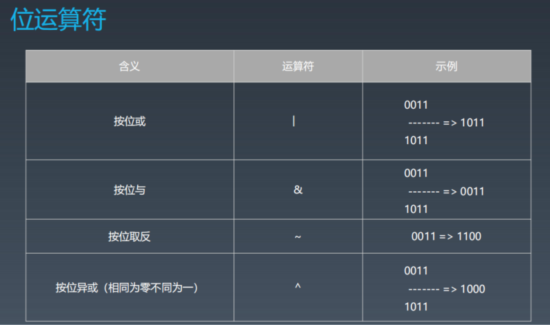
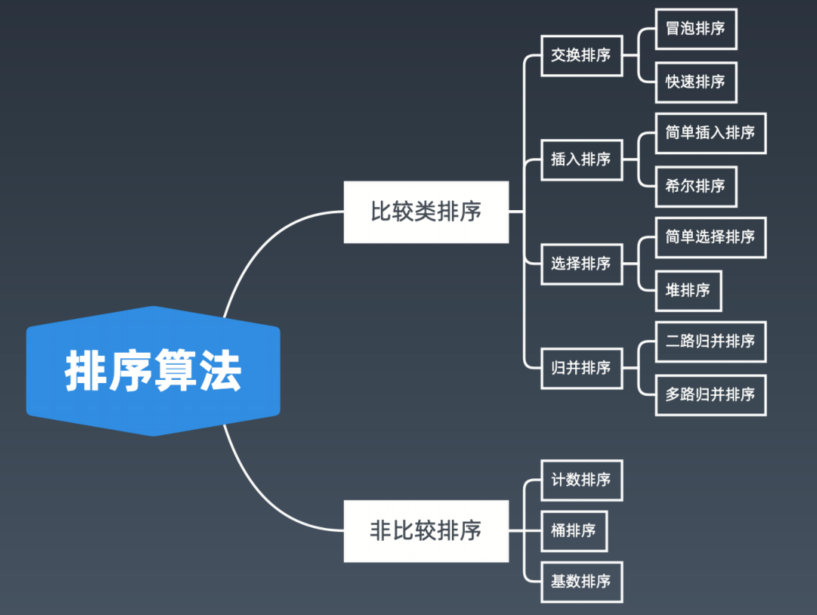
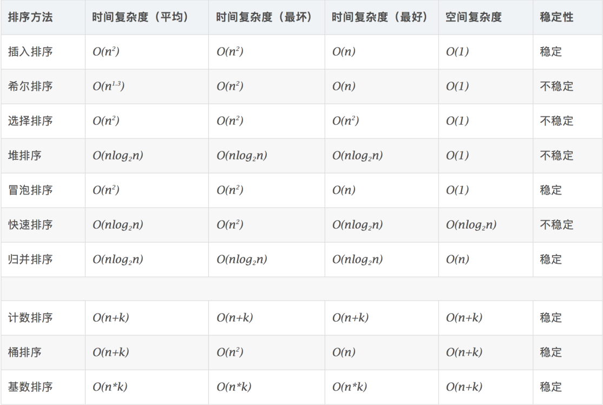

- [17 位运算](#17-位运算)
  - [17.1.知识点](#171知识点)
  - [17.2.实战题目](#172实战题目)
- [18.布隆过滤器和LRU缓存](#18布隆过滤器和lru缓存)
  - [18.1.布隆过滤器的实现及应用](#181布隆过滤器的实现及应用)
  - [18.2.LRU Cache的实现、应用和题解](#182lru-cache的实现应用和题解)
  - [18.3.实战题目](#183实战题目)
- [19.排序算法](#19排序算法)
  - [19.1.知识点](#191知识点)
    - [19.1.1.课后作业](#1911课后作业)
  - [19.2.参考链接](#192参考链接)
  - [19.3.实战题目](#193实战题目)

# 17 位运算

## 17.1.知识点

[如何从十进制转换为二进制](https://zh.wikihow.com/从十进制转换为二进制)

**位运算符**

|含义|运算符|实例|
|--|--|--|
|左移|<<|0011=>0110|
|右移|>>|0110=>0011|

**XOR - 异或**

异或：相同为 0，不同为 1。也可用“不进位加法”来理解。
异或操作的一些特点：
+ x ^ 0 = x 
  + x为1，与0不同，返回1；x为0，与0相同，返回0；因此 X ^ 0 = x
+ x ^ 1s = ~x // 注意 1s = ~0
  + x ^ (~0) = ~0，当x=1，1 ^ 1 = 0(~1)，当x=0时，0 ^ 1 = 1(~0)
+ x ^ (~x) = 1s
  + x ^ (~x) = ~0，当x=1时，1 ^ (~1) = 1(~0)，当x=0时，0 ^ (~0) = 1(~0)
+ x ^ x = 0
  + 异或的定义，相同为0
+ c = a ^ b => a ^ c = b, b ^ c = a // 交换两个数
+ a ^ b ^ c = a ^ (b ^ c) = (a ^ b) ^ c // associative

**指定位置的位运算**
1. 将 x 最右边的 n 位清零：x & (~0 << n)
   1. (~0 << n) 先将int型的0按位取反得到1，然后将全1左移 n 位，这样右n位为全0，
   2. 再与 x，就是将 x 最右边的 n 位清零了
2. 获取 x 的第 n 位值（0 或者 1）： (x >> n) & 1
   1. int型的 x 右移 n 位，
3. 获取 x 的第 n 位的幂值：x & (1 << n)
4. 仅将第 n 位置为 1：x | (1 << n)
5. 仅将第 n 位置为 0：x & (~ (1 << n))
6. 将 x 最高位至第 n 位（含）清零：x & ((1 << n) - 1)

**实战位运算要点**
+ 判断奇偶：
x % 2 == 1 —> (x & 1) == 1
x % 2 == 0 —> (x & 1) == 0
+ x >> 1 —> x / 2. 
即： x = x / 2; —> x = x >> 1;
mid = (left + right) / 2; —> mid = (left + right) >> 1;
+ X = X & (X-1) 清零最低位的 1
+ X & -X => 得到最低位的 1
+ X & ~X => 0

[N 皇后位运算代码示例](https://shimo.im/docs/YzWa5ZZrZPYWahK2/read)

## 17.2.实战题目

### 17.2.1.leedcode题目：[191. 位1的个数](https://leetcode-cn.com/problems/number-of-1-bits/)

### 17.2.2.leedcode题目：[231. 2的幂](https://leetcode-cn.com/problems/power-of-two/)

### 17.2.3.leedcode题目：[190. 颠倒二进制位](https://leetcode-cn.com/problems/reverse-bits/)

### 17.2.4.leedcode题目：[51. N 皇后](https://leetcode-cn.com/problems/n-queens/description/)

### 17.2.5.leedcode题目：[52. N皇后 II](https://leetcode-cn.com/problems/n-queens-ii/description/)

### 17.2.6.leedcode题目：[338. 比特位计数](https://leetcode-cn.com/problems/counting-bits/description/)

# 18.布隆过滤器和LRU缓存

## 18.1.布隆过滤器的实现及应用

[布隆过滤器的原理和实现](https://www.cnblogs.com/cpselvis/p/6265825.html)
[使用布隆过滤器解决缓存击穿、垃圾邮件识别、集合判重](https://blog.csdn.net/tianyaleixiaowu/article/details/74721877)
[布隆过滤器 Python 代码示例](https://shimo.im/docs/UITYMj1eK88JCJTH)
[布隆过滤器 Python 实现示例](https://www.geeksforgeeks.org/bloom-filters-introduction-and-python-implementation/)
[高性能布隆过滤器 Python 实现示例](https://github.com/jhgg/pybloof)
[布隆过滤器 Java 实现示例 1](https://github.com/lovasoa/bloomfilter/blob/master/src/main/java/BloomFilter.java)
[布隆过滤器 Java 实现示例 2](https://github.com/Baqend/Orestes-Bloomfilter)

一个很长的二进制向量和一系列随机映射函数。布隆过滤器可以用于检索
一个元素是否在一个集合中。 

**优点是空间效率和查询时间都远远超过一般的算法**， 

**缺点是有一定的误识别率和删除困难**。

## 18.2.LRU Cache的实现、应用和题解

[Understanding the Meltdown exploit](https://www.sqlpassion.at/archive/2018/01/06/understanding-the-meltdown-exploit-in-my-own-simple-words/)
[替换算法总揽](https://en.wikipedia.org/wiki/Cache_replacement_policies)
[LRU Cache Python 代码示例](https://shimo.im/docs/CoyPAyXooGcDuLQo)

**两个要素**： 大小 、替换策略

+ Hash Table + Double LinkedList
+ O(1) 查询  
+ O(1) 修改、更新

## 18.3.实战题目

### 18.3.1.leedcode题目：[146. LRU缓存机制](https://leetcode-cn.com/problems/lru-cache/#/)

# 19.排序算法

## 19.1.知识点

**1、比较类排序**：
通过比较来决定元素间的相对次序，由于其时间复杂度不能突破
O(nlogn)，因此也称为非线性时间比较类排序。
**2、非比较类排序**：
不通过比较来决定元素间的相对次序，它可以突破基于比较排序的时
间下界，以线性时间运行，因此也称为线性时间非比较类排序。

**初级排序** - O(n^2)
1. 选择排序（Selection Sort）
每次找最小值，然后放到待排序数组的起始位置。

2. 插入排序（Insertion Sort）
从前到后逐步构建有序序列；对于未排序数据，在已排序序列中从后
向前扫描，找到相应位置并插入。

3. 冒泡排序（Bubble Sort）
嵌套循环，每次查看相邻的元素如果逆序，则交换。

**高级排序** - O(N*LogN)

1. 快速排序（Quick Sort）
数组取标杆 pivot，将小元素放 pivot左边，大元素放右侧，然后依
次对右边和右边的子数组继续快排；以达到整个序列有序

2. 归并排序（Merge Sort）— 分治
   1. 把长度为n的输入序列分成两个长度为n/2的子序列；
   2. 对这两个子序列分别采用归并排序；
   3. 将两个排序好的子序列合并成一个最终的排序序列。

归并 和 快排 具有相似性，但步骤顺序相反
归并：先排序左右子数组，然后合并两个有序子数组
快排：先调配出左右子数组，然后对于左右子数组进行排序

3. 堆排序（Heap Sort） — 堆插入 O(logN)，取最大/小值 O(1)
   1. 数组元素依次建立小顶堆
   2. 依次取堆顶元素，并删除

[十大经典排序算法](https://www.cnblogs.com/onepixel/p/7674659.html)
[快速排序代码示例](https://shimo.im/docs/TX9bDbSC7C0CR5XO)
[归并排序代码示例](https://shimo.im/docs/sDXxjjiKf3gLVVAU)
[堆排序代码示例](https://shimo.im/docs/M2xfacKvwzAykhz6)

**特殊排序** - O(n)
1. 计数排序（Counting Sort）
计数排序要求输入的数据必须是有确定范围的整数。将输入的数据值转化为键存
储在额外开辟的数组空间中；然后依次把计数大于 1 的填充回原数组

2. 桶排序（Bucket Sort）
桶排序 (Bucket sort)的工作的原理：假设输入数据服从均匀分布，将数据分到
有限数量的桶里，每个桶再分别排序（有可能再使用别的排序算法或是以递归方
式继续使用桶排序进行排）。

3. 基数排序（Radix Sort）
基数排序是按照低位先排序，然后收集；再按照高位排序，然后再收集；依次类
推，直到最高位。有时候有些属性是有优先级顺序的，先按低优先级排序，再按
高优先级排序。

### 19.1.1.课后作业
用自己熟悉的编程语言，手写各种初级排序代码，提交到学习总结中。

## 19.2.参考链接

[十大经典排序算法](https://www.cnblogs.com/onepixel/p/7674659.html)
[9 种经典排序算法可视化动画](https://www.bilibili.com/video/av25136272)
[6 分钟看完 15 种排序算法动画展示](https://www.bilibili.com/video/av63851336)

## 19.3.实战题目 
数组的相对排序（谷歌在半年内面试中考过）
有效的字母异位词（Facebook、亚马逊、谷歌在半年内面试中考过）
力扣排行榜（Bloomberg 在半年内面试中考过）
合并区间（Facebook、字节跳动、亚马逊在半年内面试中常考）
翻转对（字节跳动在半年内面试中考过）

### 19.3.1.leedcode题目：[1122. 数组的相对排序](https://leetcode-cn.com/problems/relative-sort-array/)
### 19.3.2.leedcode题目：[242. 有效的字母异位词](https://leetcode-cn.com/problems/valid-anagram/)
### 19.3.3.leedcode题目：[力扣排行榜](https://leetcode-cn.com/problems/design-a-leaderboard/)
### 19.3.4.leedcode题目：[56. 合并区间](https://leetcode-cn.com/problems/merge-intervals/)
### 19.3.5.leedcode题目：[56. 合并区间](https://leetcode-cn.com/problems/reverse-pairs/)

