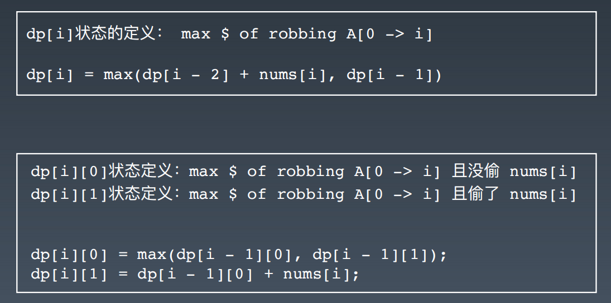
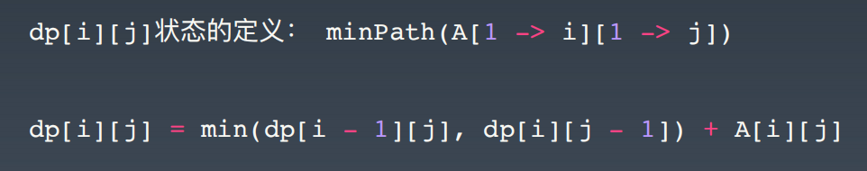

- [20.高级动态规划](#20高级动态规划)
  - [20.1.知识点](#201知识点)
  - [20.2.高阶的 DP 问题](#202高阶的-dp-问题)
  - [20.3.实战题目](#203实战题目)
    - [20.3.1.leedcode题目：爬楼梯](#2031leedcode题目爬楼梯)
    - [20.3.2.leedcode题目：不同路径](#2032leedcode题目不同路径)
    - [20.3.3.leedcode题目：打家劫舍](#2033leedcode题目打家劫舍)
    - [20.3.4.leedcode题目：最小路径和](#2034leedcode题目最小路径和)
    - [20.3.5.leedcode题目：股票买卖](#2035leedcode题目股票买卖)
    - [20.3.6.leedcode题目：在学习总结中，写出不同路径 2 这道题目的状态转移方程](#2036leedcode题目在学习总结中写出不同路径-2-这道题目的状态转移方程)
    - [20.3.7.leedcode题目：使用最小花费爬楼梯](#2037leedcode题目使用最小花费爬楼梯)
    - [20.3.8.leedcode题目：编辑距离](#2038leedcode题目编辑距离)
    - [20.3.9.leedcode题目：最长上升子序列](#2039leedcode题目最长上升子序列)
    - [20.3.10.leedcode题目：解码方法](#20310leedcode题目解码方法)
    - [20.3.11.leedcode题目：最长有效括号](#20311leedcode题目最长有效括号)
    - [20.3.12.leedcode题目：最大矩形](#20312leedcode题目最大矩形)
    - [20.3.13.leedcode题目：不同的子序列](#20313leedcode题目不同的子序列)
    - [20.3.14.leedcode题目：赛车](#20314leedcode题目赛车)
- [21.字符串算法](#21字符串算法)
  - [21.1.知识点](#211知识点)
  - [21.2.实战题目](#212实战题目)
    - [20.2.1.leedcode题目：转换成小写字母](#2021leedcode题目转换成小写字母)
    - [20.2.2.leedcode题目：最后一个单词的长度](#2022leedcode题目最后一个单词的长度)
    - [20.2.3.leedcode题目：宝石与石头](#2023leedcode题目宝石与石头)
    - [20.2.4.leedcode题目：字符串中的第一个唯一字符](#2024leedcode题目字符串中的第一个唯一字符)
    - [20.2.5.leedcode题目：字符串转换整数 (atoi) ](#2025leedcode题目字符串转换整数-atoi-)
    - [20.2.6.leedcode题目：最长公共前缀](#2026leedcode题目最长公共前缀)
    - [20.2.7.leedcode题目：[反转字符串](https://leetcode-cn.com/problems/reverse-string](#2027leedcode题目反转字符串httpsleetcode-cncomproblemsreverse-string)
    - [20.2.8.leedcode题目：反转字符串 II ](#2028leedcode题目反转字符串-ii-)
    - [20.2.9.leedcode题目：翻转字符串里的单词](#2029leedcode题目翻转字符串里的单词)
    - [20.2.10.leedcode题目：反转字符串中的单词 III ](#20210leedcode题目反转字符串中的单词-iii-)
    - [20.2.11.leedcode题目：仅仅反转字母](#20211leedcode题目仅仅反转字母)
    - [20.2.12.leedcode题目：有效的字母异位词](#20212leedcode题目有效的字母异位词)
    - [20.2.13.leedcode题目：字母异位词分组](#20213leedcode题目字母异位词分组)
    - [20.2.14.leedcode题目：找到字符串中所有字母异位词](#20214leedcode题目找到字符串中所有字母异位词)
    - [20.2.15.leedcode题目：验证回文串](#20215leedcode题目验证回文串)
    - [20.2.16.leedcode题目：验证回文字符串 Ⅱ](#20216leedcode题目验证回文字符串-ⅱ)
    - [20.2.17.leedcode题目：最长回文子串](#20217leedcode题目最长回文子串)

# 20.高级动态规划

## 20.1.知识点

递归 - 函数自己调用自己

分治 - 分而治之

**动态规划** Dynamic Programming

1. “Simplifying a complicated problem by breaking it down into 
simpler sub-problems” 
(in a recursive manner)

2. Divide & Conquer + Optimal substructure 
 分治 + 最优子结构

3. 顺推形式： 动态递推


**关键点**

动态规划 和 递归或者分治 没有根本上的区别（关键看有无最优的子结构） 

拥有共性：找到重复子问题

差异性：最优子结构、中途可以淘汰次优解

**常见的 DP 题目和状态方程**

爬楼梯： $f(n) = f(n - 1) + f(n - 2) , f(1) = 1, f(0) = 0$

不同路径： $f(x, y) = f(x-1, y) + f(x, y-1)$

打家劫舍：

最小路径和：

股票买卖：
```java
dp[i][k][0 or 1] (0 <= i <= n-1, 1 <= k <= K)

• i 为天数
• k 为最多交易次数
• [0,1] 为是否持有股票

总状态数： n * K * 2 种状态

for 0 <= i < n:
    for 1 <= k <= K:
        for s in {0, 1}:
            dp[i][k][s] = max(buy, sell, rest)

 dp[i][k][0] = max(dp[i-1][k][0], dp[i-1][k][1] + prices[i])
               max( 选择 rest   ,  选择 sell )

 解释：今天我没有持有股票，有两种可能：
- 我昨天就没有持有，然后今天选择 rest，所以我今天还是没有持有；
- 我昨天持有股票，但是今天我 sell 了，所以我今天没有持有股票了。

dp[i][k][1] = max(dp[i-1][k][1], dp[i-1][k-1][0] - prices[i])
              max( 选择 rest   ,  选择 buy )

解释：今天我持有着股票，有两种可能：
- 我昨天就持有着股票，然后今天选择 rest，所以我今天还持有着股票；
- 我昨天本没有持有，但今天我选择 buy，所以今天我就持有股票了。
 ```

初始状态：
$dp[-1][k][0] = dp[i][0][0] = 0$
$dp[-1][k][1] = dp[i][0][1] = -infinity$

状态转移方程：
$dp[i][k][0] = max(dp[i-1][k][0], dp[i-1][k][1] + prices[i])$
$dp[i][k][1] = max(dp[i-1][k][1], dp[i-1][k-1][0] - prices[i])$


## 20.2.高阶的 DP 问题

**复杂度来源**
1. 状态拥有更多维度（二维、三维、或者更多、甚至需要压缩）
2. 状态方程更加复杂

**本质：内功、逻辑思维、数学**

**爬楼梯问题改进**

• 1、2、3
• x1, x2, …, xm 步
• 前后不能走相同的步伐

**编辑距离**

• 如果 word1[i] 与 word2[j] 相同，显然 dp[i][j]=dp[i-1][j-1]

• 如果 word1[i] 与 word2[j] 不同，那么 dp[i][j] 可以通过 
 1. 在 dp[i-1][j-1] 的基础上做 replace 操作达到目的 
 2. 在 dp[i-1][j] 的基础上做 insert 操作达到目的 
 3. 在 dp[i][j-1] 的基础上做 delete 操作达到目的 
取三者最小情况即可


## 20.3.实战题目

### 20.3.1.leedcode题目：[爬楼梯](https://leetcode-cn.com/problems/climbing-stairs/)

### 20.3.2.leedcode题目：[不同路径](https://leetcode-cn.com/problems/unique-paths/)

### 20.3.3.leedcode题目：[打家劫舍](https://leetcode-cn.com/problems/house-robber/)

### 20.3.4.leedcode题目：[最小路径和](https://leetcode-cn.com/problems/minimum-path-sum/)

### 20.3.5.leedcode题目：[股票买卖](https://leetcode-cn.com/problems/best-time-to-buy-and-sell-stock/)

### 20.3.6.leedcode题目：在学习总结中，写出[不同路径 2](https://leetcode-cn.com/problems/unique-paths-ii/) 这道题目的状态转移方程

### 20.3.7.leedcode题目：[使用最小花费爬楼梯](https://leetcode-cn.com/problems/min-cost-climbing-stairs/)

### 20.3.8.leedcode题目：[编辑距离](https://leetcode-cn.com/problems/edit-distance/)

### 20.3.9.leedcode题目：[最长上升子序列](https://leetcode-cn.com/problems/longest-increasing-subsequence/)

### 20.3.10.leedcode题目：[解码方法](https://leetcode-cn.com/problems/decode-ways/)

### 20.3.11.leedcode题目：[最长有效括号](https://leetcode-cn.com/problems/longest-valid-parentheses/)

### 20.3.12.leedcode题目：[最大矩形](https://leetcode-cn.com/problems/maximal-rectangle/)

### 20.3.13.leedcode题目：[不同的子序列](https://leetcode-cn.com/problems/distinct-subsequences/)

### 20.3.14.leedcode题目：[赛车](https://leetcode-cn.com/problems/race-car/)


# 21.字符串算法

## 21.1.知识点

**字符串**
```java
String x = "abbc";
```

**遍历字符串**
```java
String x = "abbc";
for (int i = 0; i < x.size(); ++i){
    char ch = x.charAt(i);
}
for ch in x.toCharArray(){
    System.out.print(ch);
}
```
**字符串比较**
```java
String x = new String("abb");
String y = new String("abb");

x == y --> false

x.equals(y) --> true
x.equalslgnoreCase(y) --> true
```

**字符串相关算法**

参考链接

[不可变字符串](https://lemire.me/blog/2017/07/07/are-your-strings-immutable/)
[Atoi 代码示例](https://shimo.im/docs/5kykuLmt7a4DdjSP)


## 21.2.实战题目

**字符串基础问题**

### 20.2.1.leedcode题目：[转换成小写字母](https://leetcode-cn.com/problems/to-lower-case/)

### 20.2.2.leedcode题目：[最后一个单词的长度](https://leetcode-cn.com/problems/length-of-last-word/)

### 20.2.3.leedcode题目：[宝石与石头](https://leetcode-cn.com/problems/jewels-and-stones/)

### 20.2.4.leedcode题目：[字符串中的第一个唯一字符](https://leetcode-cn.com/problems/first-unique-character-in-a-string/)

### 20.2.5.leedcode题目：[字符串转换整数 (atoi) ](https://leetcode-cn.com/problems/string-to-integer-atoi/)

**字符串操作问题**

### 20.2.6.leedcode题目：[最长公共前缀](https://leetcode-cn.com/problems/longest-common-prefix/description/)

### 20.2.7.leedcode题目：[反转字符串](https://leetcode-cn.com/problems/reverse-string

### 20.2.8.leedcode题目：[反转字符串 II ](https://leetcode-cn.com/problems/reverse-string-ii/)

### 20.2.9.leedcode题目：[翻转字符串里的单词](https://leetcode-cn.com/problems/reverse-words-in-a-string/)

### 20.2.10.leedcode题目：[反转字符串中的单词 III ](https://leetcode-cn.com/problems/reverse-words-in-a-string-iii/)

### 20.2.11.leedcode题目：[仅仅反转字母](https://leetcode-cn.com/problems/reverse-only-letters/)

**异位词问题**

### 20.2.12.leedcode题目：[有效的字母异位词](https://leetcode-cn.com/problems/valid-anagram/)

### 20.2.13.leedcode题目：[字母异位词分组](https://leetcode-cn.com/problems/group-anagrams/)

### 20.2.14.leedcode题目：[找到字符串中所有字母异位词](https://leetcode-cn.com/problems/find-all-anagrams-in-a-string/)

**回文串问题**

### 20.2.15.leedcode题目：[验证回文串](https://leetcode-cn.com/problems/valid-palindrome/)

### 20.2.16.leedcode题目：[验证回文字符串 Ⅱ](https://leetcode-cn.com/problems/valid-palindrome-ii/)

### 20.2.17.leedcode题目：[最长回文子串](https://leetcode-cn.com/problems/longest-palindromic-substring/)


