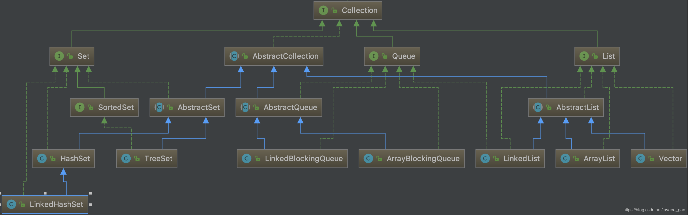
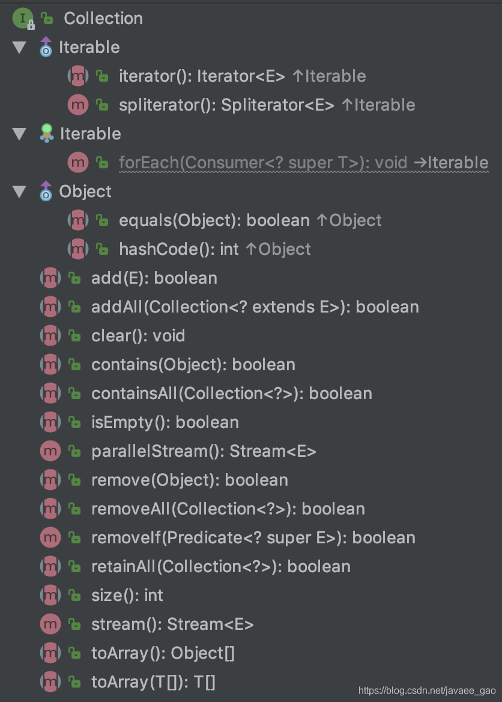

# 1.java集合Collection常用方法

[原文链接](https://blog.csdn.net/javaee_gao/article/details/96372530)

集合分为 Collection 和 Map 两种体系。



Collection接口是 (java.util.Collection)是Java集合类的顶级接口之一，整个集合框架就围绕一组标准接口而设计。

**Collection方法接口介绍**

Collection 接口有 3 种子类型集合: List、Set 和 Queue，再下面是一些抽象类，最后是具体实现类，常用的有 ArrayList、LinkedList、HashSet、LinkedHashSet、ArrayBlockingQueue等，下面是Collection的所有方法。



这些方法即可以操作Set集合，也可以操作Queue和List集合,下面分别使用Collection集合接口的方法说明

|方法名|说明|
|--|--|
|boolean add(E e)|向集合添加元素e，若指定集合元素改变了则返回true|
|boolean addAll(Collection<? extends E> c)|把集合C中的元素全部添加到集合中，若指定集合元素改变返回true|
|void clear()|清空所有集合元素|
|boolean contains(Object o)|判断指定集合是否包含对象o|
|boolean containsAll(Collection<?> c)|判断指定集合是否包含集合c的所有元素|
|boolean isEmpty()|判断指定集合的元素size是否为0|
|boolean remove(Object o)|删除集合中的元素对象o,若集合有多个o元素，则只会删除第一个元素|
|boolean removeAll(Collection<?> c)|删除指定集合包含集合c的元素|
|boolean retainAll(Collection<?> c)|从指定集合中保留包含集合c的元素,其他元素则删除|
|int size()|集合的元素个数|
|T[] toArray(T[] a)|将集合转换为T类型的数组|

**主要方法演示**
```java
@Test
@SuppressWarnings("all")
public void testCollection() {
    // 创建Collection接口的实现
    Collection collection = new ArrayList<>();
    // 添加元素
    collection.add("嘻嘻");
    String src = "????";
    collection.add(src);
    System.out.println(collection);

    // 创建Collection的实现
    Collection<String> coll = new HashSet<>();
    coll.add("?");
    coll.add("?");
    coll.add("?");
    System.out.println(coll);
    // 添加一个集合数据
    collection.addAll(coll);
    // 输出集合的长度
    System.out.println(collection);
    // 判断是否包含
    System.out.println(collection.contains("?"));
    // 移除元素
    collection.remove("?");
    // 添加对象
    collection.add(new Person("张三", 23, 5000d));
    // 当认为两个对象属性一致，相等时候，需重写hashCode 和 equals方法
    System.out.println(collection.contains(new Person("张三", 23, 5000d)));

    System.out.println("-------");
    collection.add(null);

    Collection<String> collection1 = new ArrayList<>();
    collection1.add("嘻嘻");
    collection1.add("?");
    // 求两个集合的交集(只保留collection1存在的元素)
    collection.retainAll(collection1);
    System.out.println(collection);
    // 清空元素
    collection.clear();
    System.out.println(collection);
}
```