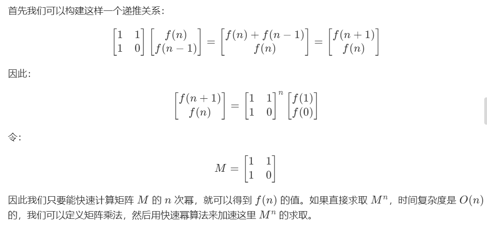
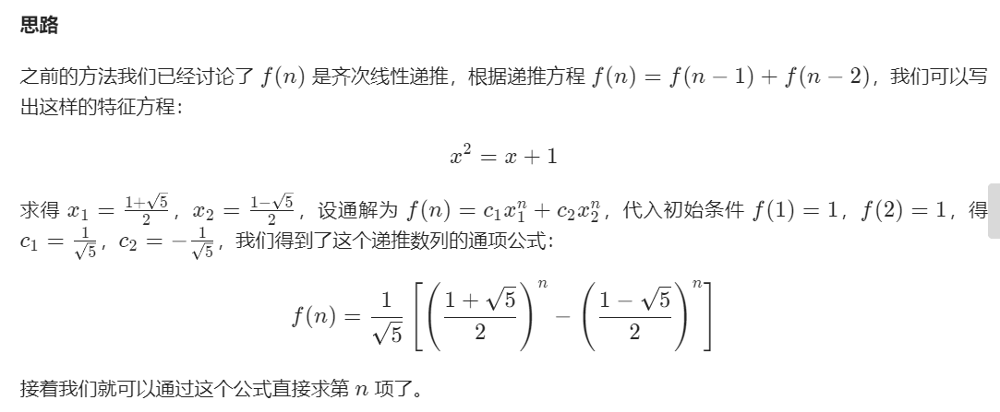

- [- Day31：leedcode题目：](#ulliday31leedcode题目liul)
- [每日刷题](#每日刷题)
  - [Day1：leedcode题目：70.爬楼梯](#day1leedcode题目70爬楼梯)
  - [Day2：leedcode题目：66.加一](#day2leedcode题目66加一)
  - [Day3：leedcode题目：1.两数之和](#day3leedcode题目1两数之和)
  - [Day4：leedcode题目：24.两两交换链表中的节点](#day4leedcode题目24两两交换链表中的节点)
  - [Day11: leedcode题目：412.Fizz Buzz](#day11-leedcode题目412fizz-buzz)
  - [Day12: leedcode题目：258.各位相加](#day12-leedcode题目258各位相加)
  - [Day13: leedcode题目：94.二叉树的中序遍历](#day13-leedcode题目94二叉树的中序遍历)
  - [Day14：leedcode题目：590.N叉树的后序遍历](#day14leedcode题目590n叉树的后序遍历)
  - [Day15：leedcode题目：1160.拼写单词](#day15leedcode题目1160拼写单词)
  - [Day16：剑指offer：05.替换空格](#day16剑指offer05替换空格)
  - [Day17：剑指offer：06.从尾到头打印链表](#day17剑指offer06从尾到头打印链表)
  - [Day18：剑指offer： 68.II. 二叉树的最近公共祖先](#day18剑指offer-68ii-二叉树的最近公共祖先)
  - [Day19：leedcode刷题：1.两数之和](#day19leedcode刷题1两数之和)
  - [Day20：leedcode题目：77.组合](#day20leedcode题目77组合)
  - [Day21：leedcode题目：46.全排列](#day21leedcode题目46全排列)
  - [Day22：leedcode题目：104.二叉树的最大深度](#day22leedcode题目104二叉树的最大深度)
  - [Day24：leedcode题目：226.翻转二叉树](#day24leedcode题目226翻转二叉树)
  - [Day25：leedcode题目：860.柠檬水找零](#day25leedcode题目860柠檬水找零)
  - [Day26：leedcode题目：200.岛屿数量](#day26leedcode题目200岛屿数量)
  - [Day27：leedcode题目：55.跳跃游戏](#day27leedcode题目55跳跃游戏)
  - [Day28：leedcode题目：102.二叉树的层序遍历](#day28leedcode题目102二叉树的层序遍历)
  - [Day31：leedcode题目：874.模拟行走机器人](#day31leedcode题目874模拟行走机器人)
  - [Day32：leedcode题目：53.最大子序和](#day32leedcode题目53最大子序和)
  - [Day64：leedcode题目：64.最小路径和](#day64leedcode题目64最小路径和)
<<<<<<< HEAD
  - [Day31：leedcode题目：](#day31leedcode题目)
=======
  - [Day31：leedcode题目：874.模拟行走机器人](#day31leedcode题目874模拟行走机器人)
>>>>>>> temp

# 每日刷题

  **_开始时间：2020 年 7 月 27号_**

## Day1：leedcode题目：[70.爬楼梯](https://leetcode-cn.com/problems/climbing-stairs/)

+ 第一种解法：递归
```java
 public static int climbStairs(int n) {
    if (n == 1) return 1;
    if (n == 2) return 2;
    return climbStairs(n - 1) + climbStairs(n - 2);
}
```
**复杂度**：复杂度太高，提交不能通过
+ 第二种解法：动态规划，在递归的基础上改为迭代
```java
public int climbStairs1(int n) {
    int a = 0, b = 0;
    int res = 1;
    for (int i = 0; i < n; i++) {
        a = b;
        b = res;
        res = a + b;
    }
    return res;
}
```
**复杂度**：时间复杂度O(n) 空间复杂度O(1)

+ 第三种解法：数学上矩阵幂法
下面是该方法的数学推导过程

此程序需要创建矩阵的乘法和矩阵幂的函数
```java
public int climbStairs2(int n) {
    int[][] M = new int[][]{{1, 1}, {1, 0}};
    int[][] res = power(M, n);
    return res[0][0];
}

public int[][] power(int[][] m, int n) {
    int[][] e = new int[][]{{1, 0}, {0, 1}};
    int[][] res = multiply(e, m);
    for (int i = 1; i < n; i++) {
        res = multiply(res, m);
    }
    return res;
}

public int[][] multiply(int[][] a, int[][] b) {
    int[][] c = new int[2][2];
    for (int i = 0; i < 2; i++) {
        for (int j = 0; j < 2; j++) {
            c[i][j] = a[i][0] * b[0][j] + a[i][1] * b[1][j];
        }
    }
    return c;
}
```
**复杂度**：时间复杂度O(logn)，空间复杂度O(1)

+ 第四种解法：通项公式法

下面是通项公式法的推导过程

```java
public int climbStairs3(int n){
    double sqar5 = Math.sqrt(5);
    double res = Math.pow((1+sqar5)/2,n+1) - Math.pow((1-sqar5)/2,n+1);
    return (int)(res / sqar5);
}
```
**复杂度**：时间复杂度：O(logn)，pow方法将会用去O(logn) 的时间。
空间复杂度：O(1)。

## Day2：leedcode题目：[66.加一](https://leetcode-cn.com/problems/plus-one/)
+ 第一种解法：遍历数组，让最后一个数组元素加1，如果加1后大于等于10，就将这个数模10（即取个位数）后放在这个位置，只要模10后的数不为0，就可以返回数组了，如果模10后是0，那说明进位到0位是还需要进1，那就只能扩充数组了。
```java
public class Solution66 {
    //数组遍历
    public int[] plusOne1(int[] digits){
        int len = digits.length;
        for (int i = len - 1; i >= 0; i--){
            digits[i]++;
            digits[i] %= 10;
            if (digits[i] != 0){
                return digits;
            }
        }
        digits = new int[len + 1];
        digits[0] = 1;
        return digits;
    }
}
```
+ 第二种解法：数学方式
```java
public class Solution66 {
    //数学方式
    public int[] plusOne2(int[] digits){
        int carry = 0;
        int sum = 0;
        int n = digits.length;
        int add = 1;
        digits[n-1] = digits[n-1] + add;
        for (int i = n-1; i >= 0; i--){
            sum = digits[i] + carry;
            carry = sum / 10;
            digits[i] = sum % 10;
        }
        if (digits[0] == 0){
            digits = new int[n + 1];
            digits[0] = carry;
        }
        return digits;
    }
}
```

## Day3：leedcode题目：[1.两数之和](https://leetcode-cn.com/problems/two-sum/)

+ 第一种解法：暴力解，
```java
//暴力解，两边循环，时间复杂度O(n^2),空间复杂度O(1)
public int[] twoSum(int[] nums,int target){
    int[] ans = new int[2];
    for (int i = 0; i < nums.length-1; i++){
        for (int j = i + 1; j < nums.length; j++){
            if (nums[i] + nums[j] == target){
                ans[0] = i;
                ans[1] = j;
            }
        }
    }
    return ans;
}
```
+ 第二种解法：遍历两遍hash表
```java
//遍历两边哈希表法,时间复杂度O(n),空间复杂度O(n)
public int[] twoSumHash(int[] nums, int target) {
    if (nums == null || nums.length == 0 ) return new int[2];

    Map<Integer, Integer> map = new HashMap<>();
    for (int i = 0; i < nums.length; i++){
        map.put(nums[i], i);
    }

    int[] ans = new int[2];
    for (int i = 0; i < nums.length; i++){
        if (map.containsKey(target - nums[i]) && map.get(target - nums[i]) != i){
            ans[0] = i;
            ans[1] = map.get(target - nums[i]);
        }
    }
    return ans;
}
```
+ 第三种解法：一遍哈希表
```java
//一遍hash表,时间复杂度O(n),空间复杂度O(n)
public int[] twoSumHash1(int[] nums, int target){
    int[] ans = new int[2];
    Map<Integer, Integer> map = new HashMap<>();
    for (int i = 0; i < nums.length; i++){
        if (map.containsKey(target - nums[i]) && map.get(target - nums[i]) != i){
            ans[0] = i;
            ans[1] = map.get(target - nums[i]);
        }
        map.put(nums[i],i);
    }
    return ans;
}
```
## Day4：leedcode题目：[24.两两交换链表中的节点](https://leetcode-cn.com/problems/swap-nodes-in-pairs/)
+ 第一种解法：递归，时间复杂度O（n），空间复杂度O（n)
```java
public class Solution24 {
    public ListNode swapPairs(ListNode head) {
        if (head == null || head.next == null) {
            return head;
        }
        ListNode next = head.next;
        head.next = swapPairs(next.next);
        next.next = head;
        return next;
    }

    public ListNode swapPairs1(ListNode head){
        //递归结束条件
        if (head == null || head.next == null){
            return head;
        }
        //执行本层程序，交换节点
        ListNode firstNode = head;
        ListNode secNode = head.next;
        firstNode.next = swapPairs1(secNode.next);
        secNode.next = firstNode;
        
        return secNode;
    }
}
```
+ 第二种解法：迭代
```java
public class Solution24 {
    //迭代法
    public ListNode swapPairs2(ListNode head){
        if (head == null || head.next == null){
            return head;
        }
        ListNode newhead = new ListNode(-1);
        ListNode pre = newhead;
        while (head != null && head.next != null){
            ListNode FN = head;
            ListNode SN = head.next;

            pre.next = SN;
            FN.next = SN.next;
            SN.next = FN;

            pre = FN;
            head = FN.next;
        }
        return newhead.next;
    }
}
```

## Day11: leedcode题目：[412.Fizz Buzz](https://leetcode-cn.com/problems/fizz-buzz/)
+ 第一种解法：遍历
  + 思路：
  + 1、初始化一个答案列表ans
  + 2、让i从1到n循环
  + 3、if i既是3的倍数又是5的倍数，把FizzBuzz加入答案列表
  + 4、if i是3的倍数，把Fizz加入答案列表
  + 5、if i是5的倍数，把Buzz加入答案列表
  + 6、都不是，就把数字本身加入答案列表
```java
public List<String> fizzBuzz(int n) {
    List<String> ans = new ArrayList<String>();
    for(int i = 1; i <= n ; i++) {
        if ( i % 3 == 0 && i % 5 == 0) {
            ans.add("FizzBuzz");
        } else if(i % 3 == 0) {
            ans.add("Fizz");
        } else if(i % 5 == 0) {
            ans.add(Integer.toString(i));
        }
    }
    return ans;
}
```
**复杂度**：时间复杂度O(n) 空间复杂度O(1)
+ 第二种解法：目的是减少循环次数，并没有降低复杂度
  
  先判断这个数是否是3的倍数，在判断是否是5的倍数，若是3的倍数，就把“Fizz”添加到答案字符里，若是5的倍数，再将“Buzz”添加到答案字符里，最后将答案字符添加到答案列表里
```java
public List<String> fizzBuzz2(int n){
    List<String> ans = new ArrayList<>();
    for (int i = 1; i <= n; i++) {
        String str = "";
        if (i % 3 == 0) {
            str += "Fizz";
        }
        if (i % 5 == 0) {
            str += "Buzz";
        }
        if (str.equals("")){
            str += Integer.toString(i);
        }
        ans.add(str);
    }
    return ans;
}
```
**复杂度**：时间复杂度O(n),空间复杂度O(1)
+ 第三种解法：哈希表
    + 初始化一个答案列表
    + 把映射关系写到一个哈希表fizzbuzzmap里{3：“Fizz”；5：“Buzz”}
    + 遍历1...N
    + 对于每一个数字，遍历fizzbuzzmap中的键值，检查是否可以被键值整除
    + 如果可以被这个键值整除，就将这个键值对应的字符，添加到答案字符串中，
    + 最后将答案字符串加到答案列表中
```java
public List<String> fizzBuzz3(int n){
    List<String> ans = new ArrayList<>();
    Map<Integer, String> fizzbuzzmap = new HashMap<>(){
        {
            put(3,"Fizz");
            put(5,"Buzz");
        }
    };
    for (int i = 1; i <= n; i++){
        String str = "";
        for (Integer k : fizzbuzzmap.keySet()){
            if (i % k == 0){
                str += fizzbuzzmap.get(k);
            }
        }
        if (str.equals("")){
            str += Integer.toString(i);
        }
        ans.add(str);
    }
    return ans;
}
```
**复杂度**：时间复杂度O(n) 空间复杂度O(1)

## Day12: leedcode题目：[258.各位相加](https://leetcode-cn.com/problems/add-digits/)
+ 第一种解法：递归
  + 若num小于10，可直接返回
  + 创建一个辅助空间next，通过将num mod 10 得到个位上的数，num除10得到十位上的数，加和后赋值给next，
  + 递归调用这个函数
```java
public int addDigits(int num) {
    if (num < 10) {
        return num;
    }
    int next = 0;
    while (num != 0) {
        next = next + num % 10;
        num /= 10;
    }
    return addDigits(next);
}
```
+ 第二种解法：在递归的基础上做修改，使用迭代法
```java
public int addDigit2(int num){
    while (num >= 10){
        int next = 0;
        while (num != 0){
            next = next + num % 10;
            num /= 10;
        }
        num = next;
    }
    return num;
}
```
+ 第三种解法：[数学解法](https://leetcode-cn.com/problems/add-digits/solution/xiang-xi-tong-su-de-si-lu-fen-xi-duo-jie-fa-by-5-7/)
  
要求的这个数，叫做[数根](https://baike.baidu.com/item/数根/4838735?fr=aladdin)，[数学解法](https://leetcode-cn.com/problems/add-digits/solution/xiang-xi-tong-su-de-si-lu-fen-xi-duo-jie-fa-by-5-7/)中有详细的讲解
```java
public int addDigit3(int num){
    return 1 + (num-1) % 9 ;
}
```

## Day13: leedcode题目：[94.二叉树的中序遍历](https://leetcode-cn.com/problems/binary-tree-inorder-traversal/)

+ 第一种解法：递归
  + [递归的模板](https://shimo.im/docs/EICAr9lRPUIPHxsH/read)
```java
public void recur(int level, int param) {
   //termintor（终止条件）
   if (level > MAX_LEVEL) {
      //process result
      return;
   }
   //process current logic
   process(level, param);
   //drill down
   recur(level:level + 1, newParam);
   //restore current status
}
```
 
借助一个辅助函数实现递归
```java
public List<Integer> inorderTraversal(TreeNode root) {
   List<Integer> ans = new ArrayList<>();
   helper(root,ans);
   return ans;
}
private void helper(TreeNode root, List<Integer> ans) {
   if (root != null){
      if (root.left != null){
            helper(root.left,ans);
      }
      ans.add(root.val);
      if (root.right != null){
            helper(root.right,ans);
      }
   }
}
```
**复杂度**：时间复杂度：O(n)。递归函数 T(n) = 2 \cdot T(n/2)+1T(n)=2⋅T(n/2)+1。 空间复杂度：最坏情况下需要空间O(n)，平均情况为O(\log n)O(logn)。

+ 第二种解法：基于栈的遍历
在递归的基础上，使用栈的方式
```java
public List<Integer> inorderTraversal2(TreeNode root){
   List<Integer> ans = new ArrayList<>();
   Stack<TreeNode> stack = new Stack<>();
   TreeNode curr = root;
   while (curr != null || !stack.isEmpty()){
      while (curr != null){
            stack.push(curr);
            curr = curr.left;
      }
      curr = stack.pop();
      ans.add(curr.val);
      curr = curr.right;
   }
   return ans;
}
```
复杂度：时间复杂度O(n)，空间复杂度O(n)

+ 第三种解法：莫里斯遍历
  
  先了解下 [线索二叉树](https://baike.baidu.com/item/%E7%BA%BF%E7%B4%A2%E4%BA%8C%E5%8F%89%E6%A0%91/10810037?fr=aladdin) 和 [莫里斯解法](https://stackoverflow.com/questions/5502916/explain-morris-inorder-tree-traversal-without-using-stacks-or-recursion) 后再学习此解法

## Day14：leedcode题目：[590.N叉树的后序遍历](https://leetcode-cn.com/problems/n-ary-tree-postorder-traversal/)

+ 第一种解法：递归
```java
public List<Integer> postorder(Node root){
    List<Integer> ans = new ArrayList<>();
    if (root == null) return ans;
    helper(root,ans);
    return ans;
}

public void helper(Node root , List<Integer> ans){
    if (root.children == null){
        ans.add(root.val);
        return;
    }
    for (Node n : root.children){
        helper(root, ans);
    }
    ans.add(root.val);
}
```
+ 第二种解法：迭代
```java
public List<Integer> postorder(Node root){
    List<Integer> ans = new ArrayList<>();
    if (root == null) return ans;
    LinkedList<Node> stack = new LinkedList<>();
    stack.add(root);
    while(!stack.isEmpty()){
        Node node = stack.pollLast();
        ans.add(node.val);
        if (root.children == null){
            continue;
        }
        stack.addAll(root.children);
    }
    Collections.reverse(ans);
    return ans;
}
```

## Day15：leedcode题目：[1160.拼写单词](https://leetcode-cn.com/problems/find-words-that-can-be-formed-by-characters/)

+ 第一种解法：对chars的字符进行计数，再对words中的每一单词计数，words中每个单词的字符数都小于chars的即可
```java
public int countCharacters(String[] words, String chars) {
    int[] countChars = new int[26];
    for (char c : chars.toCharArray()){
        countChars[c - 'a']++;
    }
    int ans = 0;
    for (String word : words){
        int[] countword = new int[26];
        for (char c : word.toCharArray()){
            countword[c - 'a']++;
        }
        boolean flag = true;
        for (int i = 0; i < 26; i++){
            if (countChars[i] < countword[i]){
                flag = false;
                break;
            }
        }
        if (flag){
            ans += word.length();
        }
    }
    return ans;
}
```
**复杂度**：时间复杂度O(n)，n为所有字符串的长度；空间复杂度O(S)，在本解法中S是26

## Day16：剑指offer：[05.替换空格](https://leetcode-cn.com/problems/ti-huan-kong-ge-lcof/submissions/)

+ 第一种解法：遍历，遇到空格换成%20
```java
public String replaceSpace(String s) {
    char[] chars = s.toCharArray();
    StringBuilder sb = new StringBuilder("");
    for (char c : chars) {
        if (c == ' ' ){
            sb.append('%');
            sb.append('2');
            sb.append('0');
        } else {
            sb.append(c);
        }
    }
    return sb.toString();
}
```
**复杂度**：时间复杂度O(n)，n为字符串s的长度；空间复杂度O(n)

## Day17：剑指offer：[06.从尾到头打印链表](https://leetcode-cn.com/problems/cong-wei-dao-tou-da-yin-lian-biao-lcof/solution/)

+ 第一种解法：使用栈
  + 使用栈将链表元素顺序倒置，熊链表的头结点开始，依次将每个节点压入栈内，然后再依次弹出栈内元素，并存储到数组中
```java
public int[] reverseprint(ListNode head){
    Stack<ListNode> stack = new Stack<>();
    ListNode curr = head;
    while (curr.next != null){
        stack.add(curr);
        curr = curr.next;
    }
    int size = stack.size();
    int[] ans = new int[size];
    for (int i = 0; i < size; i++){
        ans[i] = stack.pop().val;
    }
    return ans;
}
```
**复杂度**：时间复杂度：O(n)O(n)。正向遍历一遍链表，然后从栈弹出全部节点，等于又反向遍历一遍链表。空间复杂度：O(n)O(n)。额外使用一个栈存储链表中的每个节点。

## Day18：剑指offer：[ 68.II. 二叉树的最近公共祖先](https://leetcode-cn.com/problems/er-cha-shu-de-zui-jin-gong-gong-zu-xian-lcof/)

+ 第一种解法：
```java
public TreeNode lowestCommonAncestor2(TreeNode root, TreeNode p, TreeNode q) {
    if (root == null || root == q || root == p) return root;
    TreeNode left = lowestCommonAncestor(root.left,p,q);
    TreeNode right = lowestCommonAncestor(root.right,p,q);
    if (left == null) return right;
    if (right == null) return left;
    return root;
}
```
## Day19：leedcode刷题：[1.两数之和](https://leetcode-cn.com/problems/two-sum/)

+ 第一种解法：暴力解，
```java
//暴力解，两边循环，时间复杂度O(n^2),空间复杂度O(1)
public static int[] twoSum(int[] nums,int target){
    int[] ans = new int[2];
    for (int i = 0; i < nums.length-1; i++){
        for (int j = i + 1; j < nums.length; j++){
            if (nums[i] + nums[j] == target){
                ans[0] = i;
                ans[1] = j;
            }
        }
    }
    return ans;
}
```
+ 第二种解法：遍历两遍hash表
```java
//遍历两边哈希表法,时间复杂度O(n),空间复杂度O(n)
public int[] twoSumHash(int[] nums, int target) {
    if (nums == null || nums.length == 0 ) return new int[2];

    Map<Integer, Integer> map = new HashMap<>();
    for (int i = 0; i < nums.length; i++){
        map.put(nums[i], i);
    }

    int[] ans = new int[2];
    for (int i = 0; i < nums.length; i++){
        if (map.containsKey(target - nums[i]) && map.get(target - nums[i]) != i){
            ans[0] = i;
            ans[1] = map.get(target - nums[i]);
        }
    }
    return ans;
}
```
+ 第三种解法：一遍哈希表
```java
//一遍hash表,时间复杂度O(n),空间复杂度O(n)
public int[] twoSumHash1(int[] nums, int target){
    int[] ans = new int[2];
    Map<Integer, Integer> map = new HashMap<>();
    for (int i = 0; i < nums.length; i++){
        if (map.containsKey(target - nums[i]) && map.get(target - nums[i]) != i){
            ans[0] = i;
            ans[1] = map.get(target - nums[i]);
        }
        map.put(nums[i],i);
    }
    return ans;
}
```
## Day20：leedcode题目：[77.组合](https://leetcode-cn.com/problems/combinations/)

+ 第一种解法：
```java
public class Solution77 {
    List<List<Integer>> output = new LinkedList<>();
    int n;
    int k;

    public void bachtrack(int first, LinkedList<Integer> curr){
        //if the combination is done
        if (curr.size() == k){
            output.add(new LinkedList<>(curr));
        }

        for (int i = first; i < n + 1; ++i){
            //add i into the current combination
            curr.add(i);
            //use next integers to complete the combination
            bachtrack(i + 1, curr);
            //backtrack
            curr.removeLast();
        }
    }

    public List<List<Integer>> combine(int n, int k) {
        this.n = n;
        this.k = k;
        bachtrack(1,new LinkedList<Integer>());
        return output;
    }
}
```
## Day21：leedcode题目：[46.全排列](https://leetcode-cn.com/problems/permutations/)

+ 第一种解法：
```java
class Solution {
    public List<List<Integer>> permute(int[] nums) {
        int len = nums.length;
        List<List<Integer>> res = new ArrayList<>();
        if (len == 0){
            return res;
        }
        Deque<Integer> path = new ArrayDeque<>();
        boolean[] used = new boolean[len];
        dfs(nums,len,0,path,used,res);
        return res;
    }

    private void dfs(int[] nums, int len, int depth, Deque<Integer> path, boolean[] used, List<List<Integer>> res) {
        if (depth == len) {
            res.add(new ArrayList<>(path));
            return;
        }
        for (int i = 0; i < len; i++){
            if (used[i]){
                continue;
            }
            path.addLast(nums[i]);
            used[i] = true;
            dfs(nums,len,depth+1,path,used,res);
            path.removeLast();
            used[i] = false;
        }
    }
}
```

## Day22：leedcode题目：[104.二叉树的最大深度](https://leetcode-cn.com/problems/maximum-depth-of-binary-tree/)

+ 第一种解法：递归
```java
public class Solution104 {
    //递归，时间复杂度O(n)，空间复杂度O(height)
    public int maxDepth(TreeNode root) {
        if (root == null){
            return 0;
        } else {
            int leftHeight = maxDepth(root.left);
            int rightHeight = maxDepth(root.right);
            return Math.max(leftHeight,rightHeight) + 1;
        }
    }
}
```
```java
public class Solution104 {
    //递归
    public int maxDepth(TreeNode root) {

        if (root == null) return 0;

        int left_num = maxDepth(root.left);
        int right_num = maxDepth(root.right);

        return left_num>right_num ?left_num+1 : right_num+1;
    }
}
```
+ 第二种解法：广度优先遍历
```java

```

## Day24：leedcode题目：[226.翻转二叉树](https://leetcode-cn.com/problems/invert-binary-tree/description/)

+ 第一种解法：递归
```java
public class Solution226 {
    public TreeNode invertTree(TreeNode root){
        if (root == null) return null;
        TreeNode left = invertTree(root.left);
        TreeNode right = invertTree(root.right);
        root.left = right;
        root.right = left;
        return root;        
    }
}
```

## Day25：leedcode题目：[860.柠檬水找零](https://leetcode-cn.com/problems/lemonade-change/solution/)

+ 第一种解法：模拟现实
```java
public class Solution860 {
    public boolean lemonadeChange(int[] bills) {
        int five = 0;
        int ten = 0;
        for (int bill : bills){
            if (bill == 5){
                five++;
            } else if (bill == 10){
                if(five > 0){
                    five--;
                    ten++;
                } else return false;
            } else {
                if (five > 0 && ten > 0){
                    five--;
                    ten--;
                } else if (five >= 3){
                    five -= 3;
                } else return false;
            }
        }
        return true;
    }
}
```

## Day26：leedcode题目：[200.岛屿数量](https://leetcode-cn.com/problems/number-of-islands/)

+ 第一种解法：深度优先遍历，时间复杂度O(MN)，空间复杂度O(MN)，M/N为行数和列数
```java
public class Solution200 {
    //深度优先遍历
    public int numIslands(char[][] grid) {
        if (grid == null || grid.length == 0){
            return 0;
        }

        int nr = grid.length;
        int nc = grid[0].length;
        int num_islands = 0;
        for (int r = 0; r < nr; r++){
            for (int c = 0; c < nc; c++){
                if (grid[r][c] == '1'){
                    ++num_islands;
                    dfs(grid,r,c);
                }
            }
        }
        return num_islands;
    }

    void dfs(char[][] grid, int r, int c){
        int nr = grid.length;
        int nc = grid[0].length;

        if (r < 0 || c < 0 || r >= nr || c >=nc || grid[r][c] == '0'){
            return;
        }

        grid[r][c] = '0';
        dfs(grid, r - 1, c);;
        dfs(grid, r + 1, c);
        dfs(grid, r, c - 1);
        dfs(grid, r, c + 1);
    }
}
```

## Day27：leedcode题目：[55.跳跃游戏](https://leetcode-cn.com/problems/jump-game/)

+ 第一种解法：从后向前的贪心算法
```java
public class Solution55 {
    public boolean canJump(int[] nums) {
        int n = nums.length - 1;
        for (int i = n; i >= 0 ; i--){
            if (nums[i] + i >= n){
                n = i;
            }
        }
        if (n == 0) return true;
        return false;
    }
}
```

## Day28：leedcode题目：[102.二叉树的层序遍历](https://leetcode-cn.com/problems/binary-tree-level-order-traversal/submissions/)

+ 第一种解法：广度优先遍历
```java
public class Solution102 {
    public List<List<Integer>> levelOrder(TreeNode root) {
        List<List<Integer>> ans = new ArrayList<>();
        if (root == null){
            return ans;
        }

        Queue<TreeNode> nodes = new LinkedList<>();
        nodes.add(root);
        while (!nodes.isEmpty()){
            int size = nodes.size();
            List<Integer> result = new ArrayList<>();
            for (int i = 0; i < size; i++){
                TreeNode node = nodes.poll();
                result.add(node.val);
                if (node.left != null){
                    nodes.add(node.left);
                }
                if (node.right != null){
                    nodes.add(node.right);
                }
            }
            ans.add(result);
        }
        return ans;
    }
}
```

## Day31：leedcode题目：[874.模拟行走机器人](https://leetcode-cn.com/problems/walking-robot-simulation/description/)

+ 第一种解法：
```java
public class Solution874 {
    public int robotSim2(int[] commands, int[][] obstacles){
        //定义初始变量
        int ans = 0;
        int direction = 0;//0123代表北东南西
        int x = 0, y = 0;

        //记录每个朝向的变化，比较向北，为Direction[1]-->{0,1},x轴的变化为x+0；y轴的变化为y+1
        int[][] Direction = {{0,1},{1,0},{0,-1},{-1,0}};

        //创建障碍物Set表
        HashSet<String> set = new HashSet<>();
        for (int[] obs : obstacles){
            set.add(obs[0] + "," + obs[1]);
        }
        for (int com : commands){
            int next_x = 0;
            int next_y = 0;
            if (com >= 0) {
                for (int i = 0; i < com; i++) {
                    next_x = x + Direction[direction][0];
                    next_y = y + Direction[direction][1];
                    //如果遇到障碍物，返回
                    if (set.contains(next_x + "," + next_y)) break;
                    x = next_x;
                    y = next_y;
                    ans = Math.max(ans, x*x+y*y);
                }
            } else {
                direction = com == -1 ? (direction + 1) % 4 : (direction + 3) % 4;
            }
        }
        return ans;
    }
}

```

+ 第二种解法：

## Day32：leedcode题目：[53.最大子序和](https://leetcode-cn.com/problems/maximum-subarray/)

+ 第一种解法:暴力解法
```java
public class Solution32 {
    //暴力求解,会超出时间限制
    public int maxSubArray(int[] nums) {
        int len = nums.length;
        int res = Integer.MIN_VALUE;
        for (int i = 0; i < len; i++){
            for (int j = 0 ; j <= i ; j++){
                int sum = sumOfSubArray(nums, j , i);
                res = Math.max(res , sum);
            }
        }
        return res;
    }

    private int sumOfSubArray(int[] nums, int left, int right) {
        int res = 0;
        for (int k = left; k <= right; k++){
            res += nums[k];
        }
        return res;
    }
}
```

+ 第二种解法：
```java
public class Solution32 {
    //分治
    public int maxSubArray2(int[] nums) {
        return maxSubArrayDivideWithBorder(nums, 0, nums.length-1);
    }

    private int maxSubArrayDivideWithBorder(int[] nums, int left, int right) {
        //只有一个元素，也就是递归结束的情况
        if (left == right) return nums[left];

        //计算中间值
        int center = (left + right) / 2;
        int leftMax = maxSubArrayDivideWithBorder(nums, left, center); //计算左侧子序列最大值
        int rightMax = maxSubArrayDivideWithBorder(nums, center + 1, right); //计算右侧子序列最大值

        //下面计算横跨两个子序列的最大值

        //计算包含左侧子序列最后一个元素的子序列最大值
        int leftCrossMax = Integer.MIN_VALUE;
        int leftCrossSum = 0;
        for (int i = center; i >= left; i--){
            leftCrossSum += nums[i];
            leftCrossMax = Math.max(leftCrossSum,leftCrossMax);
        }

        //计算包含右侧子序列最后一个元素的子序列最大值
        int rightCrossMax = nums[center + 1];
        int rightCrossSum = 0;
        for (int i = center + 1; i <= right; i++) {
            rightCrossSum += nums[i];
            rightCrossMax = Math.max(rightCrossSum, rightCrossMax);
        }

        //计算跨中心的子序列的最大值
        int crossMax = leftCrossMax + rightCrossMax;

        //比较三者，返回最大值
        return Math.max(crossMax, Math.max(leftMax, rightMax));
    }
}
```

## Day64：leedcode题目：[64.最小路径和](https://leetcode-cn.com/problems/minimum-path-sum/)

+ 第一种解法：动态规划

```java
public class Solution64 {
    public int minPathSum(int[][] grid) {
        if (grid == null || grid.length == 0 || grid[0].length == 0){
            return 0;
        }
        int rows = grid.length;
        int columns = grid[0].length;
        int[][] dp = new int[rows][columns];
        dp[0][0] = grid[0][0];
        for (int i = 1; i < rows; i++){
            dp[i][0] = dp[i - 1][0] + grid[i][0];
        }
        for (int j = 1; j < columns; j++){
            dp[0][j] = dp[0][j - 1] + grid[0][j];
        }
        for (int i = 1; i < rows; i++){
            for (int j = 1; j < columns; j++){
                dp[i][j] = Math.min(dp[i-1][j], dp[i][j-1]) + grid[i][j];
            }
        }
        return dp[rows - 1][columns - 1];
    }
}
```
